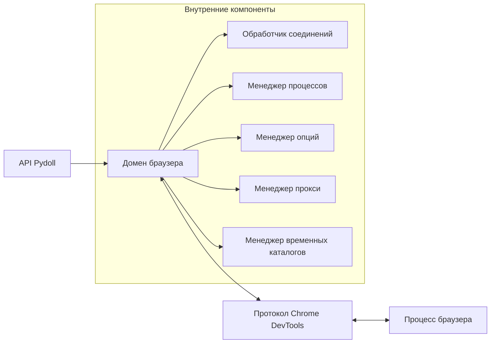
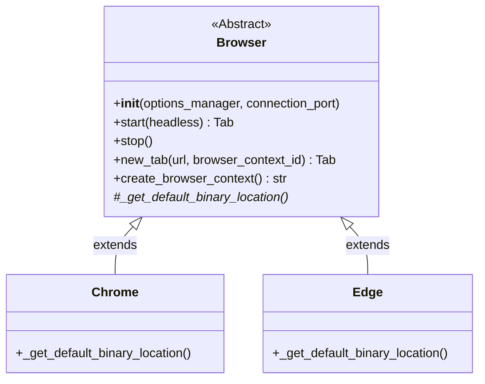
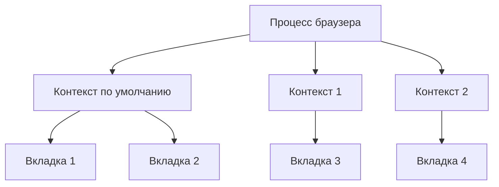

# Домен браузера

Домен браузера является основой архитектуры Pydoll без веб-драйверов. Этот компонент предоставляет прямой интерфейс к экземплярам браузера через протокол Chrome DevTools (CDP), устраняя необходимость в традиционных веб-драйверах и обеспечивая превосходную производительность и надежность.



## Техническая архитектура

По своей сути домен браузера реализован как абстрактный базовый класс (`Browser`), который устанавливает основной контракт для всех реализаций браузера. Конкретные классы браузеров, такие как `Chrome` и `Edge`, расширяют этот базовый класс для обеспечения специфичного для браузера поведения, разделяя при этом общую архитектуру.

```python
# Абстрактный базовый класс (упрощенный)
class Browser(ABC):
    def __init__(self, options_manager: BrowserOptionsManager, connection_port: Optional[int] = None):
        # Инициализировать компоненты
        # ...
    
    @abstractmethod
    def _get_default_binary_location(self) -> str:
        """Должен быть реализован подклассами"""
        pass

    async def start(self, headless: bool = False) -> Tab:
        # Запустить процесс браузера
        # Установить соединение CDP
        # Вернуть начальную вкладку для взаимодействия
        # ...

# Реализация для Chrome
class Chrome(Browser):
    def _get_default_binary_location(self) -> str:
        # Вернуть путь к бинарному файлу Chrome
        # ...
```

Абстракция позволяет Pydoll поддерживать несколько браузеров через единый интерфейс, при этом каждая реализация обрабатывает специфичные для браузера детали, такие как обнаружение исполняемого файла, аргументы командной строки и вариации протокола.

## Основные шаблоны использования

Домен браузера следует последовательному шаблону для инициализации, управления вкладками и очистки. Обратите внимание, что `start()` теперь возвращает экземпляр `Tab` напрямую:

```python
import asyncio
from pydoll.browser.chromium import Chrome

async def simple_browser_example():
    # Создать и запустить экземпляр браузера
    browser = Chrome()
    tab = await browser.start()  # Возвращает Tab напрямую
    
    try:
        # Перемещаться и взаимодействовать с вкладкой
        await tab.go_to("https://example.com")
        
        # Выполнять операции с вкладкой
        title = await tab.execute_script("return document.title")
        print(f"Заголовок страницы: {title}")
        
    finally:
        # Всегда убеждайтесь, что браузер правильно закрыт
        await browser.stop()

# Запустить асинхронный пример
asyncio.run(simple_browser_example())
```

!!! tip "Использование менеджера контекста"
    Для более чистой очистки ресурсов используйте шаблон менеджера контекста:
    
    ```python
    async def context_manager_example():
        async with Chrome() as browser:
            tab = await browser.start()
            await tab.go_to("https://example.com")
            # Браузер автоматически закрывается при выходе из контекста
    
    asyncio.run(context_manager_example())
    ```

## Иерархия реализаций браузера

Домен браузера следует четкой иерархии наследования, которая способствует повторному использованию кода, допуская при этом специфичные для браузера реализации:



Эта архитектура позволяет Pydoll поддерживать несколько типов браузеров через единый интерфейс. Каждая конкретная реализация (Chrome, Edge) должна предоставлять только специфичные для браузера детали, такие как обнаружение исполняемого файла, наследуя при этом надежную основную функциональность от базового класса Browser.

## Параметры инициализации

Домен браузера принимает два основных параметра во время инициализации, каждый из которых управляет различным аспектом поведения браузера:

### Параметр менеджера опций

Параметр `options_manager` принимает экземпляр `BrowserOptionsManager`, который обрабатывает инициализацию и настройку параметров браузера:

```python
from pydoll.browser.chromium import Chrome
from pydoll.browser.interfaces import BrowserOptionsManager

# Менеджер опций обычно обрабатывается внутри реализаций браузера
browser = Chrome()  # Внутренне использует стандартный ChromiumOptionsManager
```

Менеджер опций отвечает за:
- Инициализацию параметров браузера с соответствующими значениями по умолчанию
- Добавление необходимых аргументов CDP
- Управление специфичной для браузера конфигурацией

!!! info "Внутренняя реализация"
    Большинству пользователей не нужно напрямую взаимодействовать с менеджером опций, поскольку реализации браузеров, такие как `Chrome`, предоставляют свои собственные специализированные менеджеры внутри. Однако опытные пользователи могут создавать собственные менеджеры опций для специализированных конфигураций.

### Параметр порта подключения

Параметр `connection_port` определяет, какой порт использовать для соединения WebSocket CDP:

```python
# Указать точный порт для подключения
browser = Chrome(connection_port=9222)
```

Этот параметр служит двум различным целям:

1. **Для запуска браузера**: указывает, какой порт браузер должен открыть для связи CDP
2. **Для подключения к существующему браузеру**: определяет, к какому порту подключаться при использовании внешних экземпляров браузера

!!! warning "Доступность порта"
    Если не указано, Pydoll выбирает случайный доступный порт в диапазоне от 9223 до 9322. Если в вашей среде есть ограничения брандмауэра или сети, вам может потребоваться явно указать доступный порт.

## Внутренние компоненты

Домен браузера координирует несколько специализированных компонентов для обеспечения своей функциональности:

### Обработчик соединений

Обработчик соединений устанавливает и поддерживает связь с браузером через протокол Chrome DevTools. Он предоставляет уровень абстракции над соединением WebSocket, обрабатывая выполнение команд, обработку ответов и подписку на события.

Этот компонент является фундаментальной частью архитектуры Pydoll и будет более подробно рассмотрен в специальном разделе «Домен соединений».

### Менеджер процессов браузера

Менеджер процессов браузера обрабатывает жизненный цикл процесса браузера:

```python
class BrowserProcessManager:
    def start_browser_process(self, binary, port, arguments):
        # Запустить исполняемый файл браузера с правильными аргументами
        # Отслеживать запуск процесса
        # ...
        
    def stop_process(self):
        # Завершить процесс браузера
        # Очистить ресурсы
        # ...
```

Такое разделение ответственности гарантирует, что управление процессами браузера отделено от связи по протоколу, что делает код более удобным в обслуживании и тестировании.

### Менеджер временных каталогов

Менеджер временных каталогов обрабатывает создание и очистку временных каталогов для пользовательских данных браузера:

```python
class TempDirectoryManager:
    def create_temp_dir(self):
        # Создать временный каталог для пользовательских данных браузера
        # Вернуть дескриптор каталога
        # ...
        
    def cleanup(self):
        # Удалить временные каталоги
        # Очистить ресурсы
        # ...
```

Этот компонент гарантирует, что временные данные браузера правильно управляются и очищаются, предотвращая проблемы с дисковым пространством во время длительных сеансов автоматизации.

### Менеджер прокси

Менеджер прокси настраивает параметры прокси-сервера браузера:

```python
class ProxyManager:
    def __init__(self, options):
        # Разобрать настройки прокси из опций
        # ...
        
    def get_proxy_credentials(self):
        # Извлечь данные для аутентификации
        # Отформатировать конфигурацию прокси
        # ...
```

Этот компонент имеет решающее значение для сценариев автоматического веб-скрапинга или тестирования, требующих ротации прокси или аутентификации.

## Управление жизненным циклом и контекстом

Домен браузера реализует протокол асинхронного управления контекстом Python (`__aenter__` и `__aexit__`) для обеспечения автоматической очистки ресурсов:

```python
async def scrape_data():
    async with Chrome() as browser:
        tab = await browser.start()
        await tab.go_to('https://example.com')
        # Работать с вкладкой...
        # Браузер автоматически закрывается при выходе из контекста
```

Этот шаблон гарантирует, что процессы браузера будут правильно завершены, даже если во время автоматизации возникнут исключения, предотвращая утечки ресурсов.


### Запуск браузера и получение начальной вкладки

```python
browser = Chrome()
tab = await browser.start()  # Возвращает экземпляр Tab
await tab.go_to("https://example.com")
```

### Создание дополнительных вкладок

```python
# Создать дополнительные вкладки
tab2 = await browser.new_tab("https://github.com")
tab3 = await browser.new_tab()  # Пустая вкладка

# Работать с несколькими вкладками
await tab.go_to("https://example.com")
await tab2.go_to("https://github.com")
```

!!! tip "Автоматизация с несколькими вкладками"
    Вы можете работать с несколькими вкладками одновременно:
    
    ```python
    async def multi_tab_example():
        browser = Chrome()
        tab1 = await browser.start()
        
        # Создавать и работать с несколькими вкладками
        await tab1.go_to("https://example.com")
        
        tab2 = await browser.new_tab("https://github.com")
        
        # Получить информацию с обеих вкладок
        title1 = await tab1.execute_script("return document.title")
        title2 = await tab2.execute_script("return document.title")
        
        print(f"Вкладка 1: {title1}")
        print(f"Вкладка 2: {title2}")
        
        await browser.stop()
    ```

## Управление контекстами браузера

### Понимание контекстов браузера

Контексты браузера — одна из самых мощных функций Pydoll для создания изолированных сред просмотра. Думайте о контексте браузера как о совершенно отдельном сеансе браузера в рамках одного и того же процесса браузера — подобно открытию окна в режиме инкогнито, но с программным управлением.

Каждый контекст браузера поддерживает свои собственные:

- **Файлы cookie и хранилище сеансов**: полностью изолированы от других контекстов
- **Локальное хранилище и IndexedDB**: отдельные хранилища данных для каждого контекста
- **Кэш**: независимое кеширование для каждого контекста
- **Разрешения**: разрешения, специфичные для контекста
- **Сетевые настройки**: включая конфигурации прокси
- **Состояние аутентификации**: сеансы входа в систему специфичны для контекста



### Зачем использовать контексты браузера?

Контексты браузера необходимы для нескольких сценариев автоматизации:

1. **Тестирование нескольких учетных записей**: одновременное тестирование разных учетных записей пользователей без помех
2. **A/B-тестирование**: параллельное сравнение различных пользовательских интерфейсов
3. **Тестирование геолокации**: использование разных настроек прокси для каждого контекста
4. **Изоляция сеансов**: предотвращение взаимного загрязнения между тестовыми сценариями
5. **Параллельный скрапинг**: скрапинг нескольких сайтов с разными конфигурациями

### Создание и управление контекстами

```python
# Создать изолированный контекст браузера
context_id = await browser.create_browser_context()

# Создать вкладку в определенном контексте
tab = await browser.new_tab("https://example.com", browser_context_id=context_id)

# Получить все контексты браузера
contexts = await browser.get_browser_contexts()
print(f"Активные контексты: {contexts}")

# Удалить контекст (закрывает все связанные вкладки)
await browser.delete_browser_context(context_id)
```

### Контексты по умолчанию и пользовательские контексты

Каждый браузер запускается с **контекстом по умолчанию**, который содержит начальную вкладку, возвращаемую `browser.start()`. При необходимости вы можете создавать дополнительные контексты:

```python
browser = Chrome()
default_tab = await browser.start()  # Использует контекст по умолчанию

# Создать пользовательский контекст
custom_context_id = await browser.create_browser_context()
custom_tab = await browser.new_tab("https://example.com", browser_context_id=custom_context_id)

# Обе вкладки полностью изолированы друг от друга
await default_tab.go_to("https://site1.com")
await custom_tab.go_to("https://site2.com")
```

### Практический пример: тестирование нескольких учетных записей

Вот реальный пример одновременного тестирования нескольких учетных записей пользователей:

```python
async def test_multiple_accounts():
    browser = Chrome()
    await browser.start()
    
    # Тестовые данные для разных учетных записей
    accounts = [
        {"username": "user1@example.com", "password": "pass1"},
        {"username": "user2@example.com", "password": "pass2"},
        {"username": "admin@example.com", "password": "admin_pass"}
    ]
    
    contexts_and_tabs = []
    
    # Создать изолированный контекст для каждой учетной записи
    for i, account in enumerate(accounts):
        context_id = await browser.create_browser_context()
        tab = await browser.new_tab("https://app.example.com/login", browser_context_id=context_id)
        
        # Войти с учетными данными
        await tab.find(tag_name="input", name="username").type_text(account["username"])
        await tab.find(tag_name="input", name="password").type_text(account["password"])
        await tab.find(tag_name="button", type="submit").click()
        
        contexts_and_tabs.append((context_id, tab, account["username"]))
    
    # Теперь одновременно тестируйте разные сценарии с каждой учетной записью
    for context_id, tab, username in contexts_and_tabs:
        # Каждая вкладка поддерживает свой собственный сеанс входа
        await tab.go_to("https://app.example.com/dashboard")
        user_info = await tab.find(class_name="user-info").text
        print(f"Панель управления пользователя {username}: {user_info}")
    
    # Очистка: удалить все контексты
    for context_id, _, _ in contexts_and_tabs:
        await browser.delete_browser_context(context_id)
    
    await browser.stop()
```

### Конфигурация прокси для конкретного контекста

Каждый контекст браузера может иметь свои собственные настройки прокси, что делает его идеальным для тестирования геолокации или ротации IP-адресов:

```python
# Создать контекст с определенным прокси
context_id = await browser.create_browser_context(
    proxy_server="http://proxy.example.com:8080",
    proxy_bypass_list="localhost,127.0.0.1"
)

# Все вкладки в этом контексте будут использовать указанный прокси
tab = await browser.new_tab("https://example.com", browser_context_id=context_id)
```

### Расширенное управление контекстами

#### Управление жизненным циклом контекста

```python
async def manage_context_lifecycle():
    browser = Chrome()
    await browser.start()
    
    # Создать несколько контекстов для разных целей
    contexts = {}
    
    # Контекст для тестирования в регионе США
    us_context = await browser.create_browser_context(
        proxy_server="http://us-proxy.example.com:8080"
    )
    contexts['us'] = us_context
    
    # Контекст для тестирования в регионе ЕС
    eu_context = await browser.create_browser_context(
        proxy_server="http://eu-proxy.example.com:8080"
    )
    contexts['eu'] = eu_context
    
    # Контекст для тестирования администратора (без прокси)
    admin_context = await browser.create_browser_context()
    contexts['admin'] = admin_context
    
    try:
        # Использовать контексты для параллельного тестирования
        us_tab = await browser.new_tab("https://api.example.com/geo", browser_context_id=contexts['us'])
        eu_tab = await browser.new_tab("https://api.example.com/geo", browser_context_id=contexts['eu'])
        admin_tab = await browser.new_tab("https://admin.example.com", browser_context_id=contexts['admin'])
        
        # Каждая вкладка будет иметь разный IP/местоположение
        us_location = await us_tab.execute_script("return fetch('/api/location').then(r => r.json())")
        eu_location = await eu_tab.execute_script("return fetch('/api/location').then(r => r.json())")
        
        print(f"Местоположение контекста США: {us_location}")
        print(f"Местоположение контекста ЕС: {eu_location}")
        
    finally:
        # Очистить все контексты
        for region, context_id in contexts.items():
            await browser.delete_browser_context(context_id)
            print(f"Удален контекст {region}")
        
        await browser.stop()
```

#### Изоляция хранилища контекста

```python
async def demonstrate_storage_isolation():
    browser = Chrome()
    await browser.start()
    
    # Создать два контекста
    context1 = await browser.create_browser_context()
    context2 = await browser.create_browser_context()
    
    # Создать вкладки в каждом контексте
    tab1 = await browser.new_tab("https://example.com", browser_context_id=context1)
    tab2 = await browser.new_tab("https://example.com", browser_context_id=context2)
    
    # Установить разные данные в localStorage для каждого контекста
    await tab1.execute_script("localStorage.setItem('user', 'Alice')")
    await tab2.execute_script("localStorage.setItem('user', 'Bob')")
    
    # Проверить изоляцию - каждый контекст имеет свое собственное хранилище
    user1 = await tab1.execute_script("return localStorage.getItem('user')")
    user2 = await tab2.execute_script("return localStorage.getItem('user')")
    
    print(f"Пользователь контекста 1: {user1}")  # Alice
    print(f"Пользователь контекста 2: {user2}")  # Bob
    
    # Очистка
    await browser.delete_browser_context(context1)
    await browser.delete_browser_context(context2)
    await browser.stop()
```

## Управление целями

Получить информацию обо всех активных целях (вкладки, сервис-воркеры и т. д.) в браузере:

```python
# Получить все цели
targets = await browser.get_targets()

# Отфильтровать только цели страниц
pages = [t for t in targets if t.get('type') == 'page']

for page in pages:
    print(f"ID цели: {page['targetId']}")
    print(f"URL: {page['url']}")
    print(f"Заголовок: {page.get('title', 'Нет заголовка')}")
```

## Управление окнами

Домен браузера предоставляет методы для управления окном браузера:

```python
# Получить текущий ID окна
window_id = await browser.get_window_id()

# Установить границы окна (положение и размер)
await browser.set_window_bounds({
    'left': 100,
    'top': 100,
    'width': 1024,
    'height': 768
})

# Развернуть окно
await browser.set_window_maximized()

# Свернуть окно
await browser.set_window_minimized()
```

!!! info "Сценарии использования управления окнами"
    Управление окнами особенно полезно для:
    - Установки точных размеров окна для согласованных скриншотов
    - Позиционирования окон для многомониторных установок
    - Создания удобной для пользователя автоматизации, видимой во время разработки

## Управление файлами cookie

Домен браузера предоставляет методы для управления файлами cookie в масштабе всего браузера:

```python
# Установить файлы cookie на уровне браузера
cookies_to_set = [
    {
        "name": "session_id",
        "value": "global_session_123",
        "domain": "example.com",
        "path": "/",
        "secure": True,
        "httpOnly": True
    }
]
await browser.set_cookies(cookies_to_set)

# Получить все файлы cookie из браузера
all_cookies = await browser.get_cookies()
print(f"Количество файлов cookie: {len(all_cookies)}")

# Удалить все файлы cookie из браузера
await browser.delete_all_cookies()
```

### Управление файлами cookie для конкретного контекста

```python
# Создать контекст браузера
context_id = await browser.create_browser_context()

# Установить файлы cookie для определенного контекста
await browser.set_cookies(cookies_to_set, browser_context_id=context_id)

# Получить файлы cookie из определенного контекста
context_cookies = await browser.get_cookies(browser_context_id=context_id)

# Удалить файлы cookie из определенного контекста
await browser.delete_all_cookies(browser_context_id=context_id)
```

!!! tip "Управление файлами cookie на уровне браузера и вкладок"
    - **Файлы cookie на уровне браузера** (с использованием приведенных выше методов) применяются ко всем вкладкам в браузере или определенном контексте
    - **Файлы cookie на уровне вкладок** (с использованием `tab.set_cookies()`) применяются только к этой конкретной вкладке
    
    Выберите соответствующую область действия в зависимости от ваших потребностей в автоматизации.

## Управление загрузками

Настройте поведение загрузки для браузера или определенных контекстов:

```python
# Установить пользовательский путь для загрузки
download_path = "/path/to/downloads"
await browser.set_download_path(download_path)

# Расширенная конфигурация загрузки
await browser.set_download_behavior(
    behavior=DownloadBehavior.ALLOW,
    download_path=download_path,
    events_enabled=True  # Включить события о ходе загрузки
)

# Конфигурация загрузки для конкретного контекста
context_id = await browser.create_browser_context()
await browser.set_download_behavior(
    behavior=DownloadBehavior.ALLOW,
    download_path="/path/to/context/downloads",
    browser_context_id=context_id
)
```

## Управление разрешениями

Предоставьте или сбросьте разрешения браузера для автоматического тестирования:

```python
from pydoll.constants import PermissionType

# Предоставить разрешения глобально
await browser.grant_permissions([
    PermissionType.GEOLOCATION,
    PermissionType.NOTIFICATIONS,
    PermissionType.CAMERA
])

# Предоставить разрешения для определенного источника
await browser.grant_permissions(
    [PermissionType.GEOLOCATION],
    origin="https://example.com"
)

# Предоставить разрешения для определенного контекста
context_id = await browser.create_browser_context()
await browser.grant_permissions(
    [PermissionType.MICROPHONE],
    browser_context_id=context_id
)

# Сбросить все разрешения до значений по умолчанию
await browser.reset_permissions()
```

## Обзор системы событий

Домен браузера предоставляет методы для включения и мониторинга различных типов событий. Эти методы включают `enable_fetch_events()` и метод `on()` для регистрации обратных вызовов событий.

### Перехват запросов

```python
# Включить перехват запросов
await browser.enable_fetch_events(handle_auth_requests=True)

# Зарегистрировать обработчик событий для перехваченных запросов
async def handle_request(event):
    request_id = event['params']['requestId']
    url = event['params']['request']['url']
    
    if 'analytics' in url:
        # Блокировать запросы аналитики
        await browser.fail_request(request_id, NetworkErrorReason.BLOCKED_BY_CLIENT)
    else:
        # Продолжить другие запросы
        await browser.continue_request(request_id)

await browser.on('Fetch.requestPaused', handle_request)
```

### Выполнение пользовательского ответа

```python
async def fulfill_custom_response(event):
    request_id = event['params']['requestId']
    
    # Выполнить с пользовательским ответом
    await browser.fulfill_request(
        request_id=request_id,
        response_code=200,
        response_headers=[{'name': 'Content-Type', 'value': 'application/json'}],
        response_body={'message': 'Пользовательский ответ от Pydoll'}
    )

await browser.on('Fetch.requestPaused', fulfill_custom_response)
```

!!! warning "Область действия событий на уровне браузера и вкладок"
    При включении событий на уровне браузера (например, `browser.enable_fetch_events()`) они применяются **глобально** ко всем вкладкам в браузере. В отличие от этого, включение событий на уровне вкладок (например, `tab.enable_fetch_events()`) влияет только на эту конкретную вкладку.
    
    Это различие важно для производительности и управления ресурсами. Включайте события на уровне браузера, когда вам нужно отслеживать активность на всех вкладках, и на уровне вкладок, когда вас интересуют только события определенной вкладки.

!!! info "Подробная документация по системе событий"
    Система событий является основным компонентом архитектуры Pydoll и будет подробно рассмотрена в специальном разделе. Он будет включать типы событий, шаблоны обработки и расширенные методы, управляемые событиями.

## Конфигурация прокси

Pydoll поддерживает использование прокси для подключений к браузеру. Это полезно для веб-скрапинга, тестирования гео-специфического контента или обхода ограничений скорости на основе IP-адресов:

```python
from pydoll.browser.chromium import Chrome
from pydoll.browser.options import ChromiumOptions

options = ChromiumOptions()

# Настроить прокси
options.add_argument('--proxy-server=http://proxy.example.com:8080')

# Для прокси, требующих аутентификации
browser = Chrome(options=options)
tab = await browser.start()

# Pydoll автоматически обрабатывает запросы на аутентификацию прокси
await tab.go_to("https://example.com")
```

!!! tip "Аутентификация частного прокси"
    Pydoll автоматически обрабатывает аутентификацию частного прокси:
    
    1. Когда обнаруживается запрос на аутентификацию прокси, Pydoll перехватывает его
    2. Учетные данные прокси применяются из опций
    3. Аутентификация завершается прозрачно
    4. Ваша автоматизация продолжается без прерывания
    
    Это значительно упрощает работу с аутентифицированными прокси по сравнению с традиционной автоматизацией браузера.

## Заключение

Домен браузера служит основой архитектуры Pydoll, предоставляя мощный интерфейс для экземпляров браузера через протокол Chrome DevTools. Понимая его возможности и шаблоны, вы можете создавать сложную автоматизацию браузера, которая более надежна и эффективна, чем традиционные подходы на основе веб-драйверов.

Сочетание чистого уровня абстракции, комплексной системы событий, архитектуры на основе вкладок и прямого контроля над процессом браузера обеспечивает расширенные сценарии автоматизации при сохранении простого и интуитивно понятного API.