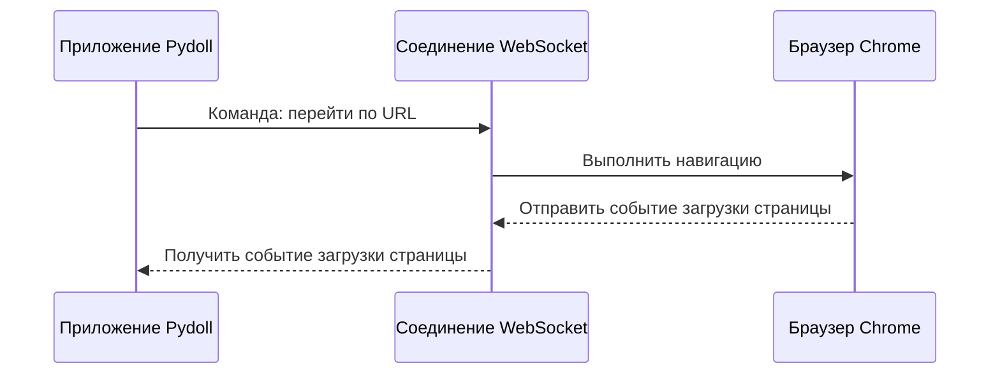
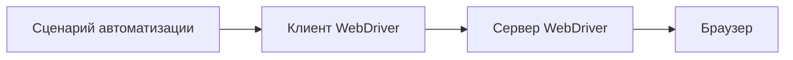
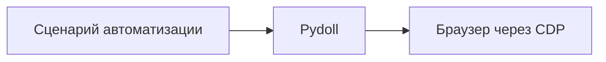
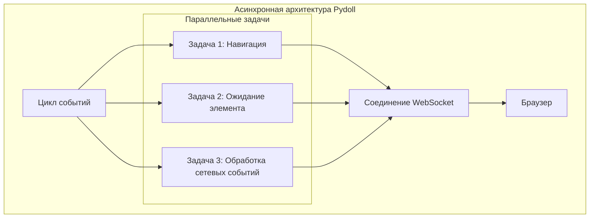

# Протокол Chrome DevTools (CDP)

Протокол Chrome DevTools (CDP) является основой, которая позволяет Pydoll управлять браузерами без традиционных веб-драйверов. Понимание того, как работает CDP, дает ценную информацию о возможностях и внутренней архитектуре Pydoll.


## Что такое CDP?

Протокол Chrome DevTools — это мощный интерфейс, разработанный командой Chromium, который позволяет программно взаимодействовать с браузерами на основе Chromium. Это тот же протокол, который используется Chrome DevTools при проверке веб-страницы, но он представлен в виде программируемого API, который могут использовать инструменты автоматизации.

По своей сути CDP предоставляет полный набор методов и событий для взаимодействия с внутренними компонентами браузера. Это позволяет детально контролировать каждый аспект браузера, от навигации между страницами до управления DOM, перехвата сетевых запросов и мониторинга показателей производительности.

!!! info "Эволюция CDP"
    Протокол Chrome DevTools постоянно развивается с момента своего появления. Google поддерживает и обновляет протокол с каждым выпуском Chrome, регулярно добавляя новые функции и улучшая существующие.
    
    Хотя протокол изначально был разработан для DevTools Chrome, его широкие возможности сделали его основой для инструментов автоматизации браузеров следующего поколения, таких как Puppeteer, Playwright и, конечно же, Pydoll.

## Связь через WebSocket

Одним из ключевых архитектурных решений в CDP является использование WebSockets для связи. Когда браузер на основе Chromium запускается с включенным флагом удаленной отладки, он открывает сервер WebSocket на указанном порту:

```
chrome --remote-debugging-port=9222
```

Pydoll подключается к этой конечной точке WebSocket для установления двунаправленного канала связи с браузером. Это соединение:

1. **Остается постоянным** на протяжении всей сессии автоматизации
2. **Обеспечивает события в реальном времени** от браузера, которые отправляются клиенту
3. **Позволяет отправлять команды** в браузер
4. **Поддерживает двоичные данные** для эффективной передачи скриншотов, PDF-файлов и других ресурсов

Протокол WebSocket особенно хорошо подходит для автоматизации браузера, поскольку он обеспечивает:

- **Связь с низкой задержкой** - необходимо для отзывчивой автоматизации
- **Двунаправленный обмен сообщениями** - необходим для архитектуры, управляемой событиями
- **Постоянные соединения** - устранение накладных расходов на установку соединения для каждой операции

Вот упрощенное представление того, как работает связь Pydoll с браузером:



!!! info "WebSocket и HTTP"
    Более ранние протоколы автоматизации браузера часто полагались на конечные точки HTTP для связи. Переход CDP на WebSockets представляет собой значительное архитектурное усовершенствование, которое обеспечивает более отзывчивую автоматизацию и мониторинг событий в реальном времени.
    
    Протоколы на основе HTTP требуют постоянного опроса для обнаружения изменений, что создает накладные расходы и задержки. WebSockets позволяют браузеру отправлять уведомления в ваш сценарий автоматизации именно тогда, когда происходят события, с минимальной задержкой.

## Ключевые домены CDP

CDP организован в логические домены, каждый из которых отвечает за определенный аспект функциональности браузера. Некоторые из наиболее важных доменов включают:


| Домен | Ответственность | Примеры использования |
|--------|----------------|------------------|
| **Browser** | Управление самим приложением браузера | Управление окнами, создание контекста браузера |
| **Page** | Взаимодействие с жизненным циклом страницы | Навигация, выполнение JavaScript, управление фреймами |
| **DOM** | Доступ к структуре страницы | Селекторы запросов, изменение атрибутов, прослушиватели событий |
| **Network** | Мониторинг и управление сетевым трафиком | Перехват запросов, проверка ответов, кеширование |
| **Runtime** | Среда выполнения JavaScript | Оценка выражений, вызов функций, обработка исключений |
| **Input** | Имитация взаимодействий с пользователем | Движения мыши, ввод с клавиатуры, сенсорные события |
| **Target** | Управление контекстами и целями браузера | Создание вкладок, доступ к iframe, обработка всплывающих окон |
| **Fetch** | Низкоуровневый перехват сети | Изменение запросов, имитация ответов, аутентификация |

Pydoll сопоставляет эти домены CDP с более интуитивно понятной структурой API, сохраняя при этом все возможности базового протокола.

## Архитектура, управляемая событиями

Одной из самых мощных функций CDP является его система событий. Протокол позволяет клиентам подписываться на различные события, которые браузер генерирует во время обычной работы. Эти события охватывают практически все аспекты поведения браузера:

- **События жизненного цикла**: загрузка страниц, навигация по фреймам, создание цели
- **События DOM**: изменения элементов, модификации атрибутов
- **Сетевые события**: циклы запросов/ответов, сообщения WebSocket
- **События выполнения**: исключения JavaScript, сообщения консоли
- **События производительности**: метрики для рендеринга, выполнения сценариев и многого другого


Когда вы включаете мониторинг событий в Pydoll (например, с помощью `page.enable_network_events()`), библиотека настраивает необходимые подписки в браузере и предоставляет перехватчики для вашего кода, чтобы реагировать на эти события.

```python
from pydoll.events.network import NetworkEvents
from functools import partial

async def on_request(page, event):
    url = event['params']['request']['url']
    print(f"Запрос к: {url}")

# Подписаться на события сетевых запросов
await page.enable_network_events()
await page.on(NetworkEvents.REQUEST_WILL_BE_SENT, partial(on_request, page))
```

Этот подход, управляемый событиями, позволяет сценариям автоматизации немедленно реагировать на изменения состояния браузера, не полагаясь на неэффективный опрос или произвольные задержки.

## Преимущества производительности прямой интеграции с CDP

Использование CDP напрямую, как это делает Pydoll, дает несколько преимуществ в производительности по сравнению с традиционной автоматизацией на основе веб-драйверов:

### 1. Устранение уровня трансляции протокола

Традиционные инструменты на основе веб-драйверов, такие как Selenium, используют многоуровневый подход:



Каждый уровень добавляет накладные расходы, особенно сервер WebDriver, который действует как уровень трансляции между протоколом WebDriver и собственными API браузера.

Pydoll упрощает это до:



Эта прямая связь устраняет вычислительные и сетевые накладные расходы промежуточного сервера, что приводит к более быстрым операциям.

### 2. Эффективная пакетная обработка команд

CDP позволяет объединять несколько команд в одно сообщение, уменьшая количество обменов, необходимых для сложных операций. Это особенно ценно для операций, требующих нескольких шагов, таких как поиск элемента и последующее взаимодействие с ним.

### 3. Асинхронная работа

Архитектура CDP на основе WebSocket, управляемая событиями, идеально согласуется с фреймворком asyncio Python, обеспечивая истинную асинхронную работу. Это позволяет Pydoll:

- Выполнять несколько операций одновременно
- Обрабатывать события по мере их возникновения
- Избегать блокировки основного потока во время операций ввода-вывода



!!! info "Прирост производительности в асинхронном режиме"
    Сочетание asyncio и CDP создает мультипликативный эффект на производительность. В тестах производительности асинхронный подход Pydoll может обрабатывать несколько страниц параллельно с почти линейным масштабированием, в то время как традиционные синхронные инструменты показывают убывающую отдачу по мере увеличения параллелизма.
    
    Например, сбор данных с 10 страниц, каждая из которых загружается 2 секунды, может занять более 20 секунд с синхронным инструментом, но чуть более 2 секунд с асинхронной архитектурой Pydoll (плюс некоторые минимальные накладные расходы).

### 4. Детальный контроль

CDP обеспечивает более детальный контроль над поведением браузера, чем протокол WebDriver. Это позволяет Pydoll реализовывать оптимизированные стратегии для общих операций:

- Более точные условия ожидания (в отличие от произвольных тайм-аутов)
- Прямой доступ к кешам и хранилищу браузера
- Целевое выполнение JavaScript в определенных контекстах
- Детальный сетевой контроль для оптимизации запросов


## Заключение

Протокол Chrome DevTools составляет основу подхода Pydoll к автоматизации браузера без веб-драйверов. Используя связь WebSocket CDP, всесторонний охват доменов, архитектуру, управляемую событиями, и прямую интеграцию с браузером, Pydoll достигает превосходной производительности и надежности по сравнению с традиционными инструментами автоматизации.

В следующих разделах мы углубимся в то, как Pydoll реализует определенные домены CDP и преобразует низкоуровневый протокол в интуитивно понятный, удобный для разработчиков API.