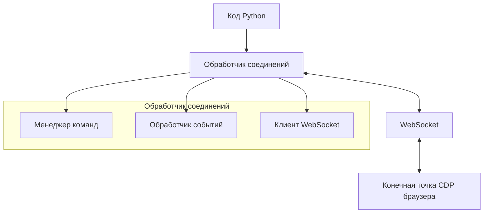
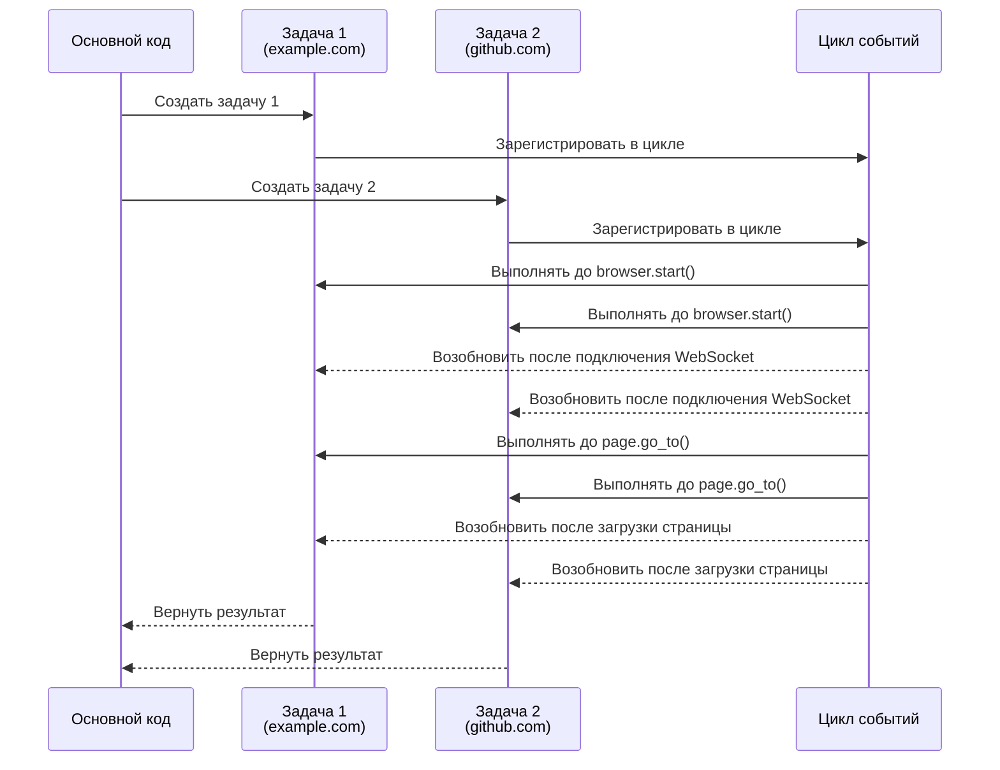
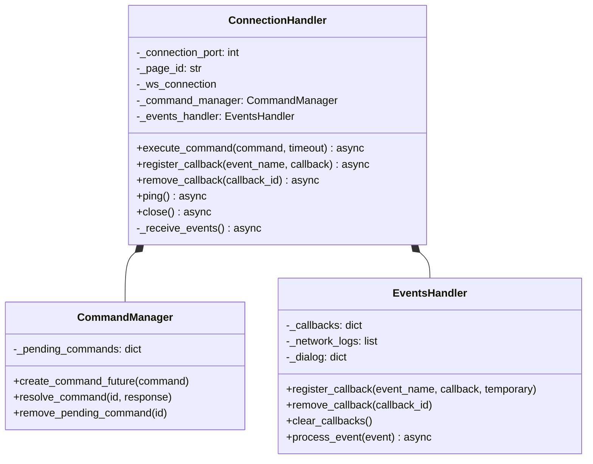
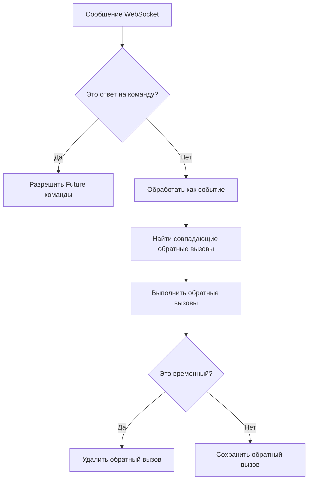
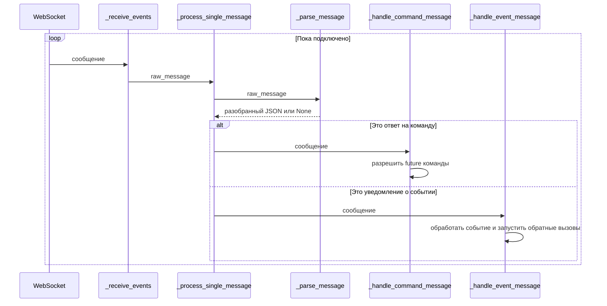

# Обработчик соединений

Обработчик соединений является основополагающим уровнем архитектуры Pydoll, служа мостом между вашим кодом Python и протоколом Chrome DevTools (CDP) браузера. Этот компонент управляет соединением WebSocket с браузером, обрабатывает выполнение команд и обрабатывает события неблокирующим, асинхронным образом.



## Асинхронная модель программирования

Pydoll построен на фреймворке `asyncio` Python, который обеспечивает неблокирующие операции ввода-вывода. Этот выбор дизайна имеет решающее значение для высокопроизводительной автоматизации браузера, поскольку он позволяет одновременно выполнять несколько операций, не дожидаясь завершения каждой из них.

### Понимание async/await


Чтобы понять, как async/await работает на практике, давайте рассмотрим более подробный пример с двумя параллельными операциями:

```python
import asyncio
from pydoll.browser.chrome import Chrome

async def fetch_page_data(url):
    print(f"Начинаем извлечение для {url}")
    browser = Chrome()
    await browser.start()
    page = await browser.get_page()
    
    # Навигация занимает время - здесь мы уступаем управление
    await page.go_to(url)
    
    # Получить заголовок страницы
    title = await page.execute_script("return document.title")
    
    # Извлечь некоторые данные
    description = await page.execute_script(
        "return document.querySelector('meta[name=\"description\"]')?.content || ''"
    )
    
    await browser.stop()
    print(f"Завершено извлечение для {url}")
    return {"url": url, "title": title, "description": description}

async def main():
    # Запустить две операции со страницами одновременно
    task1 = asyncio.create_task(fetch_page_data("https://example.com"))
    task2 = asyncio.create_task(fetch_page_data("https://github.com"))
    
    # Дождаться завершения обеих и получить результаты
    result1 = await task1
    result2 = await task2
    
    return [result1, result2]

# Запустить асинхронную функцию
results = asyncio.run(main())
```

Этот пример демонстрирует, как мы можем одновременно извлекать данные с двух разных веб-сайтов, потенциально сокращая общее время выполнения почти вдвое по сравнению с последовательным выполнением.

#### Диаграмма потока асинхронного выполнения

Вот что происходит в цикле событий при выполнении приведенного выше кода:



Эта диаграмма последовательности иллюстрирует, как asyncio Python управляет двумя параллельными задачами в нашем примере кода:

1. Основная функция создает две задачи для извлечения данных с разных веб-сайтов
2. Обе задачи регистрируются в цикле событий
3. Цикл событий выполняет каждую задачу, пока не встретит оператор `await` (например, `browser.start()`)
4. Когда асинхронные операции завершаются (например, устанавливается соединение WebSocket), задачи возобновляются
5. Цикл продолжает переключаться между задачами в каждой точке `await`
6. Когда каждая задача завершается, она возвращает свой результат в основную функцию

В примере `fetch_page_data` это позволяет обоим экземплярам браузера работать одновременно - пока один ожидает загрузки страницы, другой может продвигаться вперед. Это значительно эффективнее, чем последовательная обработка каждого веб-сайта, поскольку время ожидания ввода-вывода не блокирует выполнение других задач.

!!! info "Кооперативная многозадачность"
    Asyncio использует кооперативную многозадачность, при которой задачи добровольно уступают управление в точках `await`. Это отличается от вытесняющей многозадачности (потоков), где задачи могут быть прерваны в любое время. Кооперативная многозадачность может обеспечить лучшую производительность для операций, связанных с вводом-выводом, но требует тщательного кодирования, чтобы избежать блокировки цикла событий.

## Реализация обработчика соединений

Класс `ConnectionHandler` предназначен для управления как выполнением команд, так и обработкой событий, предоставляя надежный интерфейс для соединения WebSocket CDP.

### Инициализация класса

```python
def __init__(
    self,
    connection_port: int,
    page_id: str = 'browser',
    ws_address_resolver: Callable[[int], str] = get_browser_ws_address,
    ws_connector: Callable = websockets.connect,
):
    # Инициализировать компоненты...
```

ConnectionHandler принимает несколько параметров:

| Параметр | Тип | Описание |
|-----------|------|-------------|
| `connection_port` | `int` | Номер порта, на котором прослушивается конечная точка CDP браузера |
| `page_id` | `str` | Идентификатор конкретной страницы/цели (используйте «browser» для соединений на уровне браузера) |
| `ws_address_resolver` | `Callable` | Функция для разрешения URL-адреса WebSocket по номеру порта |
| `ws_connector` | `Callable` | Функция для установления соединения WebSocket |

### Внутренние компоненты

ConnectionHandler управляет тремя основными компонентами:

1. **Соединение WebSocket**: управляет фактической связью WebSocket с браузером
2. **Менеджер команд**: обрабатывает отправку команд и получение ответов
3. **Обработчик событий**: обрабатывает события от браузера и запускает соответствующие обратные вызовы



## Поток выполнения команд

При выполнении команды через CDP ConnectionHandler следует определенному шаблону:

1. Убедиться в наличии активного соединения WebSocket
2. Создать объект Future для представления ожидающего ответа
3. Отправить команду через WebSocket
4. Ожидать разрешения Future с ответом
5. Вернуть ответ вызывающей стороне

```python
async def execute_command(self, command: dict, timeout: int = 10) -> dict:
    # Проверить команду
    if not isinstance(command, dict):
        logger.error('Команда должна быть словарем.')
        raise exceptions.InvalidCommand('Команда должна быть словарем')

    # Убедиться, что соединение активно
    await self._ensure_active_connection()
    
    # Создать future для этой команды
    future = self._command_manager.create_command_future(command)
    command_str = json.dumps(command)

    # Отправить команду и ожидать ответа
    try:
        await self._ws_connection.send(command_str)
        response: str = await asyncio.wait_for(future, timeout)
        return json.loads(response)
    except asyncio.TimeoutError as exc:
        self._command_manager.remove_pending_command(command['id'])
        raise exc
    except websockets.ConnectionClosed as exc:
        await self._handle_connection_loss()
        raise exc
```

!!! warning "Тайм-аут команды"
    Команды, которые не получают ответа в течение указанного периода тайм-аута, вызовут `TimeoutError`. Это предотвращает зависание сценариев автоматизации на неопределенный срок из-за отсутствия ответов. Тайм-аут по умолчанию составляет 10 секунд, но его можно настроить в зависимости от ожидаемого времени ответа для сложных операций.

## Система обработки событий

Система событий является ключевым архитектурным компонентом, который обеспечивает реактивные шаблоны программирования в Pydoll. Она позволяет регистрировать обратные вызовы для определенных событий браузера и автоматически выполнять их при возникновении этих событий.

### Поток событий

Поток обработки событий следует этим шагам:

1. Метод `_receive_events` выполняется как фоновая задача, непрерывно получая сообщения от WebSocket
2. Каждое сообщение анализируется и классифицируется как ответ на команду или событие
3. События передаются в EventsHandler для обработки
4. EventsHandler определяет зарегистрированные обратные вызовы для события и вызывает их



### Регистрация обратного вызова

ConnectionHandler предоставляет методы для регистрации, удаления и управления обратными вызовами событий:

```python
# Зарегистрировать обратный вызов для определенного события
callback_id = await connection.register_callback(
    'Page.loadEventFired', 
    handle_page_load
)

# Удалить определенный обратный вызов
await connection.remove_callback(callback_id)

# Удалить все обратные вызовы
await connection.clear_callbacks()
```

!!! tip "Временные обратные вызовы"
    Вы можете зарегистрировать обратный вызов как временный, что означает, что он будет автоматически удален после однократного срабатывания. Это полезно для одноразовых событий, таких как обработка диалоговых окон:
    
    ```python
    await connection.register_callback(
        'Page.javascriptDialogOpening',
        handle_dialog,
        temporary=True
    )
    ```

### Асинхронное выполнение обратного вызова

Обратные вызовы могут быть как синхронными функциями, так и асинхронными сопрограммами. ConnectionHandler правильно обрабатывает оба типа:

```python
# Синхронный обратный вызов
def synchronous_callback(event):
    print(f"Получено событие: {event['method']}")

# Асинхронный обратный вызов
async def asynchronous_callback(event):
    await asyncio.sleep(0.1)  # Выполнить некоторую асинхронную операцию
    print(f"Событие обработано асинхронно: {event['method']}")

# Оба могут быть зарегистрированы одинаково
await connection.register_callback('Network.requestWillBeSent', synchronous_callback)
await connection.register_callback('Network.responseReceived', asynchronous_callback)
```

Для асинхронных обратных вызовов ConnectionHandler оборачивает их в задачу, которая выполняется в фоновом режиме, позволяя циклу обработки событий продолжаться, не дожидаясь завершения обратного вызова.

## Управление соединениями

ConnectionHandler реализует несколько стратегий для обеспечения надежных соединений:

### Ленивое установление соединения

Соединения устанавливаются только при необходимости, обычно при выполнении первой команды или по явному запросу. Этот ленивый подход к инициализации экономит ресурсы и обеспечивает более гибкое управление соединениями.

### Автоматическое переподключение

Если соединение WebSocket потеряно или неожиданно закрыто, ConnectionHandler попытается автоматически восстановить его при выполнении следующей команды. Это обеспечивает устойчивость к временным проблемам с сетью.

```python
async def _ensure_active_connection(self):
    """
    Гарантирует наличие активного соединения перед продолжением.
    """
    if self._ws_connection is None or self._ws_connection.closed:
        await self._establish_new_connection()
```

### Очистка ресурсов

ConnectionHandler реализует как явные методы очистки, так и протокол асинхронного менеджера контекста Python (`__aenter__` и `__aexit__`), обеспечивая правильное освобождение ресурсов, когда они больше не нужны:

```python
async def close(self):
    """
    Закрывает соединение WebSocket и очищает все обратные вызовы.
    """
    await self.clear_callbacks()
    if self._ws_connection is not None:
        try:
            await self._ws_connection.close()
        except websockets.ConnectionClosed as e:
            logger.info(f'Соединение WebSocket закрыто: {e}')
        logger.info('Соединение WebSocket закрыто.')
```

!!! info "Использование менеджера контекста"
    Использование ConnectionHandler в качестве менеджера контекста является рекомендуемым шаблоном для обеспечения правильной очистки ресурсов:
    
    ```python
    async with ConnectionHandler(9222, 'browser') as connection:
        # Работать с соединением...
        await connection.execute_command(...)
    # Соединение автоматически закрывается при выходе из контекста
    ```

## Конвейер обработки сообщений

ConnectionHandler реализует сложный конвейер обработки сообщений, который обрабатывает непрерывный поток сообщений от соединения WebSocket:



Этот конвейер обеспечивает эффективную обработку как ответов на команды, так и асинхронных событий, позволяя Pydoll поддерживать отзывчивую работу даже при большом объеме сообщений.

## Расширенное использование

ConnectionHandler обычно используется косвенно через классы Browser и Page, но его также можно использовать напрямую для расширенных сценариев:

### Прямой мониторинг событий

Для специализированных случаев использования вы можете захотеть обойти высокоуровневые API и напрямую отслеживать определенные события CDP:

```python
from pydoll.connection.connection import ConnectionHandler

async def monitor_network():
    connection = ConnectionHandler(9222)
    
    async def log_request(event):
        url = event['params']['request']['url']
        print(f"Запрос: {url}")
    
    await connection.register_callback(
        'Network.requestWillBeSent', 
        log_request
    )
    
    # Включить сетевые события через команду CDP
    await connection.execute_command({
        "id": 1,
        "method": "Network.enable"
    })
    
    # Продолжать работать до прерывания
    try:
        while True:
            await asyncio.sleep(1)
    finally:
        await connection.close()
```

### Выполнение пользовательских команд

Вы можете выполнять произвольные команды CDP напрямую:

```python
async def custom_cdp_command(connection, method, params=None):
    command = {
        "id": random.randint(1, 10000),
        "method": method,
        "params": params or {}
    }
    return await connection.execute_command(command)

# Пример: получить HTML документа без использования класса Page
async def get_html(connection):
    result = await custom_cdp_command(
        connection,
        "Runtime.evaluate",
        {"expression": "document.documentElement.outerHTML"}
    )
    return result['result']['result']['value']
```

!!! warning "Расширенный интерфейс"
    Прямое использование ConnectionHandler требует глубокого понимания протокола Chrome DevTools. Для большинства случаев использования высокоуровневые API Browser и Page предоставляют более интуитивно понятный и безопасный интерфейс.


## Расширенные шаблоны параллелизма

Асинхронный дизайн ConnectionHandler обеспечивает сложные шаблоны параллелизма:

### Параллельное выполнение команд

Выполняйте несколько команд одновременно и ждите всех результатов:

```python
async def get_page_metrics(connection):
    commands = [
        {"id": 1, "method": "Performance.getMetrics"},
        {"id": 2, "method": "Network.getResponseBody", "params": {"requestId": "..."}},
        {"id": 3, "method": "DOM.getDocument"}
    ]
    
    results = await asyncio.gather(
        *(connection.execute_command(cmd) for cmd in commands)
    )
    
    return results
```

## Заключение

ConnectionHandler служит основой архитектуры Pydoll, предоставляя надежный, эффективный интерфейс для протокола Chrome DevTools. Используя фреймворк asyncio Python и связь WebSocket, он обеспечивает высокопроизводительную автоматизацию браузера с элегантными, управляемыми событиями шаблонами программирования.

Понимание дизайна и работы ConnectionHandler дает ценную информацию о внутреннем устройстве Pydoll и открывает возможности для расширенной настройки и оптимизации в специализированных сценариях.

Для большинства случаев использования вы будете взаимодействовать с ConnectionHandler косвенно через высокоуровневые API Browser и Page, которые предоставляют более интуитивно понятный интерфейс, используя при этом мощные возможности ConnectionHandler.