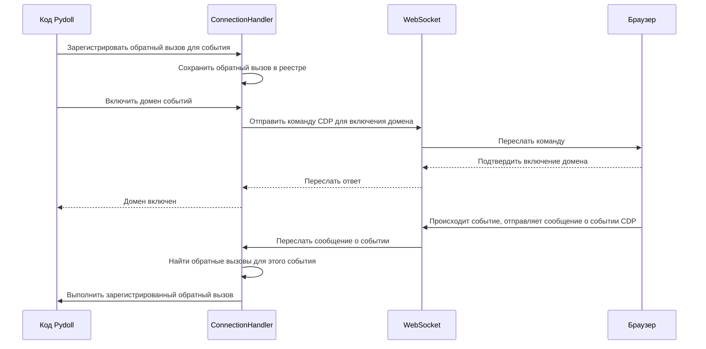
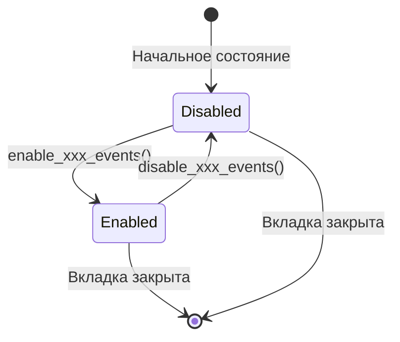
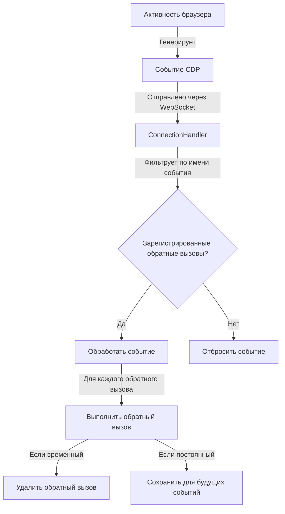
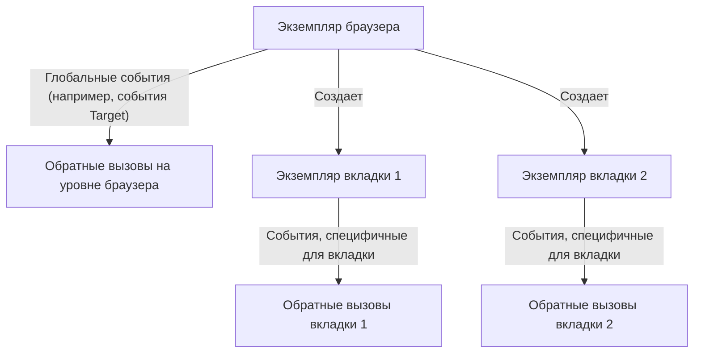

# Система событий

Система событий является основополагающим компонентом архитектуры Pydoll, предоставляя мощный механизм для реагирования на действия браузера в режиме реального времени. Эта асинхронная система уведомлений позволяет вашему коду автоматизации реагировать на различные события браузера по мере их возникновения, создавая динамичные и отзывчивые взаимодействия.

## Связь через WebSocket и CDP

В основе системы событий Pydoll лежит протокол Chrome DevTools (CDP), который предоставляет структурированный способ взаимодействия и мониторинга действий браузера через соединения WebSocket. Этот двунаправленный канал связи позволяет вашему коду как отправлять команды в браузер, так и получать от него события.



### Модель связи WebSocket

Соединение WebSocket между Pydoll и браузером следует этому шаблону:

1. **Установление соединения**: при запуске браузера создается сервер WebSocket, и Pydoll устанавливает с ним соединение
2. **Двунаправленный обмен сообщениями**: и Pydoll, и браузер могут отправлять сообщения в любое время
3. **Типы сообщений**:
   - **Команды**: отправляются из Pydoll в браузер (например, навигация, манипулирование DOM)
   - **Ответы на команды**: отправляются из браузера в Pydoll в ответ на команды
   - **События**: отправляются из браузера в Pydoll, когда что-то происходит (например, загрузка страницы, сетевая активность)

### Структура протокола Chrome DevTools

CDP организует свою функциональность в домены, каждый из которых отвечает за определенную область функциональности браузера:

| Домен | Ответственность | Типичные события |
|--------|----------------|----------------|
| Page | Жизненный цикл страницы | События загрузки, навигация, диалоговые окна |
| Network | Сетевая активность | Мониторинг запросов/ответов, WebSockets |
| DOM | Структура документа | Изменения DOM, модификации атрибутов |
| Fetch | Перехват запросов | Запрос приостановлен, требуется аутентификация |
| Runtime | Выполнение JavaScript | Сообщения консоли, исключения |
| Browser | Управление браузером | Создание окон, вкладок, контекстов |

Каждый домен должен быть явно включен, прежде чем он начнет генерировать события, что помогает управлять производительностью, обрабатывая только те события, которые действительно необходимы.

## Домены событий и их включение

Pydoll организует события в логические домены, которые соответствуют доменам CDP. Каждый домен должен быть явно включен, прежде чем он начнет генерировать события, что выполняется с помощью специальных методов включения.

```python
# Включить события страницы для мониторинга загрузки страницы, навигации, диалоговых окон и т. д.
await tab.enable_page_events()

# Включить сетевые события для мониторинга запросов, ответов и т. д.
await tab.enable_network_events()

# Включить события DOM для мониторинга изменений DOM
await tab.enable_dom_events()

# Включить события fetch для перехвата и изменения запросов
await tab.enable_fetch_events()
```

!!! info "Владение доменом"
    События принадлежат определенным доменам в зависимости от их функциональности. Например, события загрузки страницы принадлежат домену Page, а события сетевых запросов — домену Network. Некоторые домены доступны только на определенных уровнях — например, события Page доступны в экземпляре Tab, но не непосредственно на уровне Browser.

### Почему требуется включение/отключение

Явный шаблон включения/отключения служит нескольким важным целям:

1. **Оптимизация производительности**: включая только те домены, которые вас интересуют, вы уменьшаете накладные расходы на обработку событий
2. **Управление ресурсами**: некоторые домены событий (например, мониторинг сети или DOM) могут генерировать большие объемы событий, потребляющих память
3. **Ясность намерений**: явное включение делает намерения кода автоматизации ясными и самодокументируемыми
4. **Контролируемая очистка**: явное отключение доменов обеспечивает правильную очистку, когда события больше не нужны



!!! warning "Предотвращение утечек событий"
    Неотключение доменов событий, когда они больше не нужны, может привести к утечкам памяти и снижению производительности, особенно в длительных процессах автоматизации. Всегда отключайте домены событий, когда вы закончили с ними работать, особенно для событий с большим объемом, таких как мониторинг сети.

### Методы включения для конкретных доменов

Различные домены включаются с помощью специальных методов для соответствующих объектов:

| Домен | Метод включения | Метод отключения | Доступно на |
|--------|--------------|----------------|--------------|
| Page | `enable_page_events()` | `disable_page_events()` | Tab |
| Network | `enable_network_events()` | `disable_network_events()` | Tab |
| DOM | `enable_dom_events()` | `disable_dom_events()` | Tab |
| Fetch | `enable_fetch_events()` | `disable_fetch_events()` | Tab, Browser |
| File Chooser | `enable_intercept_file_chooser_dialog()` | `disable_intercept_file_chooser_dialog()` | Tab |

## Регистрация обратных вызовов событий

Центральным методом для подписки на события является метод `on()`, доступный как в экземплярах Tab, так и в Browser:

```python
async def on(
    self, event_name: str, callback: callable, temporary: bool = False
) -> int:
    """
    Регистрирует слушатель событий для вкладки.

    Args:
        event_name (str): Имя события для прослушивания.
        callback (callable): Функция обратного вызова для выполнения, когда
            событие срабатывает.
        temporary (bool): Если True, обратный вызов будет удален после того, как он
            сработает один раз. По умолчанию False.

    Returns:
        int: ID зарегистрированного обратного вызова.
    """
```

Этот метод возвращает ID обратного вызова, который можно использовать для его последующего удаления при необходимости.

### Типы и параметры обратных вызовов

Обратные вызовы могут быть как синхронными функциями, так и асинхронными сопрограммами:

```python
# Пример синхронного обратного вызова
def handle_page_load(event):
    print(f"Страница загружена в: {time.time()}")

# Пример асинхронного обратного вызова
async def handle_network_request(event):
    request_url = event['params']['request']['url']
    print(f"Запрос отправлен на: {request_url}")
    # Здесь можно выполнять асинхронные операции
    await save_request_details(request_url)

# Зарегистрировать обратные вызовы
await tab.on('Page.loadEventFired', handle_page_load)
await tab.on('Network.requestWillBeSent', handle_network_request)
```

!!! tip "Асинхронные обратные вызовы"
    Использование асинхронных обратных вызовов обеспечивает большую гибкость, позволяя выполнять другие асинхронные операции в обратном вызове, такие как выполнение дополнительных команд CDP или ожидание условий.

### Использование `partial` для доступа к вкладке в обратных вызовах

Мощный метод — использовать `functools.partial` для передачи экземпляра Tab в ваши обратные вызовы, что позволяет обратному вызову взаимодействовать с вкладкой:

```python
from functools import partial

# Определить обратный вызов, которому нужен доступ к вкладке
async def handle_navigation(tab, event):
    # Теперь обратный вызов может использовать объект tab
    print(f"Произошла навигация на: {await tab.current_url}")
    
    # Прямой доступ к методам вкладки
    elements = await tab.find(tag_name="a")
    print(f"Найдено {len(elements)} ссылок на новой странице")

# Зарегистрировать с помощью partial для привязки параметра tab
await tab.enable_page_events()
await tab.on(PageEvent.FRAME_NAVIGATED, partial(handle_navigation, tab))
```

Этот метод необходим, когда:
1. Вашему обратному вызову необходимо взаимодействовать с вкладкой (поиск элементов, выполнение скриптов)
2. Вы хотите поддерживать состояние между событиями
3. Вам необходимо координировать действия между различными типами событий

!!! info "Зачем использовать `partial`?"
    Система событий передает в обратные вызовы только данные о событии. Использование `partial` позволяет предварительно настроить обратные вызовы с дополнительными параметрами (например, объектом tab) без изменения сигнатуры обратного вызова, ожидаемой системой событий.

### Временные обратные вызовы

Для событий, которые вы хотите обработать только один раз, вы можете использовать флаг `temporary`:

```python
# Этот обратный вызов будет автоматически удален после первого срабатывания
await tab.on('Page.loadEventFired', handle_first_load, temporary=True)
```

Это особенно полезно для:
- Одноразовых операций настройки
- Ожидания определенного события перед продолжением
- Обработки первого вхождения события по-другому

## Поток и жизненный цикл событий

Понимание потока событий имеет решающее значение для эффективной обработки событий:



Жизненный цикл события следует этим шагам:

1. Что-то происходит в браузере (загрузка страницы, отправка запроса, изменения DOM)
2. Браузер генерирует сообщение о событии CDP
3. Сообщение отправляется через WebSocket в Pydoll
4. ConnectionHandler получает событие
5. ConnectionHandler проверяет свой реестр на наличие обратных вызовов, соответствующих имени события
6. Если обратные вызовы существуют, каждый из них выполняется с данными о событии
7. Если обратный вызов был зарегистрирован как временный, он удаляется после выполнения

## Предопределенные константы событий

Pydoll предоставляет полный набор предопределенных констант событий в пакете `protocol`, что упрощает ссылку на общие события без запоминания точных строк событий CDP:

```python
from pydoll.protocol.page.events import PageEvent
from pydoll.protocol.network.events import NetworkEvent
from pydoll.protocol.dom.events import DomEvent
from pydoll.protocol.fetch.events import FetchEvent

# Использование предопределенных событий
await tab.on(PageEvent.LOAD_EVENT_FIRED, handle_page_load)
await tab.on(NetworkEvent.REQUEST_WILL_BE_SENT, handle_request)
await tab.on(DomEvent.DOCUMENT_UPDATED, handle_dom_update)
await tab.on(FetchEvent.REQUEST_PAUSED, handle_fetch_intercept)
```

!!! info "Пользовательские события CDP"
    Хотя Pydoll предоставляет константы для общих событий, вы можете использовать любую допустимую строку события CDP напрямую. Это полезно для менее распространенных событий, для которых нет предопределенных констант:
    
    ```python
    # Использование прямой строки события CDP
    await tab.on('Security.certificateError', handle_cert_error)
    ```

### Общие типы событий

Вот некоторые из наиболее полезных событий для автоматизации и сбора данных:

#### События страницы

| Константа | Событие CDP | Описание |
|----------|-----------|-------------|
| `PageEvent.LOAD_EVENT_FIRED` | `Page.loadEventFired` | Срабатывает при возникновении события загрузки страницы |
| `PageEvent.DOM_CONTENT_EVENT_FIRED` | `Page.domContentEventFired` | Срабатывает после загрузки содержимого DOM |
| `PageEvent.FILE_CHOOSER_OPENED` | `Page.fileChooserOpened` | Срабатывает при отображении диалогового окна выбора файла |
| `PageEvent.JAVASCRIPT_DIALOG_OPENING` | `Page.javascriptDialogOpening` | Срабатывает при отображении диалогового окна JavaScript |
| `PageEvent.FRAME_NAVIGATED` | `Page.frameNavigated` | Срабатывает, когда фрейм перешел на новый URL |

#### Сетевые события

| Константа | Событие CDP | Описание |
|----------|-----------|-------------|
| `NetworkEvent.REQUEST_WILL_BE_SENT` | `Network.requestWillBeSent` | Срабатывает, когда запрос вот-вот будет отправлен |
| `NetworkEvent.RESPONSE_RECEIVED` | `Network.responseReceived` | Срабатывает при получении HTTP-ответа |
| `NetworkEvent.LOADING_FAILED` | `Network.loadingFailed` | Срабатывает, когда запрос не удается загрузить |
| `NetworkEvent.LOADING_FINISHED` | `Network.loadingFinished` | Срабатывает, когда запрос завершил загрузку |
| `NetworkEvent.WEB_SOCKET_FRAME_SENT` | `Network.webSocketFrameSent` | Срабатывает при отправке фрейма WebSocket |

#### События DOM

| Константа | Событие CDP | Описание |
|-----------|------------|-----------|
| `DomEvent.DOCUMENT_UPDATED` | `DOM.documentUpdated` | Срабатывает при обновлении документа |
| `DomEvent.SET_CHILD_NODES` | `DOM.setChildNodes` | Срабатывает при установке дочерних узлов |
| `DomEvent.ATTRIBUTE_MODIFIED` | `DOM.attributeModified` | Срабатывает при изменении атрибута элемента |
| `DomEvent.ATTRIBUTE_REMOVED` | `DOM.attributeRemoved` | Срабатывает при удалении атрибута элемента |

## Расширенные шаблоны событий

### Сбор данных на основе событий

События позволяют создавать реактивные скрейперы, которые реагируют на изменения страницы в режиме реального времени:

```python
import asyncio
from functools import partial
from pydoll.browser.chromium import Chrome
from pydoll.constants import By
from pydoll.protocol.network.events import NetworkEvent
from pydoll.protocol.page.events import PageEvent

async def scrape_dynamic_content():
    async with Chrome() as browser:
        tab = await browser.start()
        
        # Создать контейнер для хранения данных
        scraped_data = []
        data_complete = asyncio.Event()
        
        # Настроить обратный вызов для извлечения данных при получении ответов AJAX
        async def extract_data_from_response(tab, event):
            if 'api/products' in event['params']['response']['url']:
                # Извлечь тело ответа
                request_id = event['params']['requestId']
                body = await tab.get_network_response_body(request_id)
                
                # Обработать данные
                products = json.loads(body)
                for product in products:
                    scraped_data.append({
                        'id': product['id'],
                        'name': product['name'],
                        'price': product['price']
                    })
                
                print(f"Извлечено {len(products)} товаров")
                
                # Если мы собрали достаточно данных, сигнализировать о завершении
                if len(scraped_data) >= 100:
                    data_complete.set()
        
        # Настроить мониторинг навигации
        async def handle_page_load(tab, event):
            print(f"Страница загружена: {await tab.current_url}")
            
            # Теперь, когда страница загружена, запустить бесконечную прокрутку
            await tab.execute_script("""
                function scrollDown() {
                    window.scrollTo(0, document.body.scrollHeight);
                    setTimeout(scrollDown, 1000);
                }
                scrollDown();
            """)
        
        # Включить события и зарегистрировать обратные вызовы
        await tab.enable_network_events()
        await tab.enable_page_events()
        await tab.on(NetworkEvent.RESPONSE_RECEIVED, partial(extract_data_from_response, tab))
        await tab.on(PageEvent.LOAD_EVENT_FIRED, partial(handle_page_load, tab))
        
        # Перейдите на страницу с динамическим содержимым
        await tab.go_to("https://example.com/products")
        
        # Ждать завершения сбора данных или тайм-аута через 60 секунд
        try:
            await asyncio.wait_for(data_complete.wait(), timeout=60)
        except asyncio.TimeoutError:
            print("Достигнут тайм-аут, продолжаем с собранными данными")
        
        # Обработать собранные данные
        print(f"Всего собрано товаров: {len(scraped_data)}")
        
        return scraped_data
```

### Параллельный сбор данных с помощью событий

События особенно эффективны в сочетании с параллельным выполнением для максимальной эффективности. Pydoll отлично справляется с одновременным управлением несколькими вкладками, что является одним из его главных преимуществ для высокопроизводительной автоматизации.

#### Подход с несколькими вкладками в одном браузере

Более эффективный подход — использовать несколько вкладок в одном экземпляре браузера:

```python
import asyncio
from functools import partial
import json
from pydoll.browser.chromium import Chrome
from pydoll.constants import By
from pydoll.protocol.network.events import NetworkEvent

async def multi_tab_scraping():
    # Создать один экземпляр браузера для всех вкладок
    async with Chrome() as browser:
        tab = await browser.start()
        
        # Категории для сбора данных
        categories = ['electronics', 'clothing', 'books', 'home']
        base_url = 'https://example.com/products'
        
        # Отслеживать результаты для каждой категории
        results = {category: [] for category in categories}
        completion_events = {category: asyncio.Event() for category in categories}
        
        # Создать обратный вызов для обработки данных категории
        async def process_category_data(tab, category, event):
            if f'api/{category}' in event['params'].get('response', {}).get('url', ''):
                request_id = event['params']['requestId']
                body, _ = await tab.get_network_response_body(request_id)
                data = json.loads(body)
                
                # Добавить результаты в соответствующую категорию
                results[category].extend(data['items'])
                print(f"Добавлено {len(data['items'])} элементов в {category}, всего: {len(results[category])}")
                
                # Сигнализировать о завершении, если у нас достаточно данных
                if len(results[category]) >= 20 or data.get('isLastPage', False):
                    completion_events[category].set()
        
        # Подготовить вкладки, по одной для каждой категории
        tabs = {}
        for category in categories:
            # Создать новую вкладку
            new_tab = await browser.new_tab()
            tabs[category] = new_tab
            
            # Настроить мониторинг событий для этой вкладки
            await new_tab.enable_network_events()
            await new_tab.on(
                NetworkEvent.RESPONSE_RECEIVED,
                partial(process_category_data, new_tab, category)
            )
            
            # Начать навигацию (не ждать здесь, чтобы разрешить параллельную загрузку)
            asyncio.create_task(new_tab.go_to(f"{base_url}/{category}"))
        
        # Ждать завершения всех категорий или тайм-аута
        try:
            await asyncio.wait_for(
                asyncio.gather(*(event.wait() for event in completion_events.values())),
                timeout=45
            )
        except asyncio.TimeoutError:
            print("Некоторые категории превысили время ожидания, продолжаем с собранными данными")
        
        # Отобразить результаты
        total_items = 0
        for category, items in results.items():
            count = len(items)
            total_items += count
            print(f"{category}: собрано {count} элементов")
            
            # Показать примеры элементов
            for item in items[:2]:
                print(f"  - {item['name']}: ${item['price']}")
        
        print(f"Всего элементов по всем категориям: {total_items}")
        
        return results

# Запустить многовкладочный скрейпер
asyncio.run(multi_tab_scraping())
```

#### Динамическое создание вкладок с помощью событий

Вы даже можете создавать новые вкладки динамически в ответ на события:

```python
import asyncio
from functools import partial
from pydoll.browser.chromium import Chrome
from pydoll.constants import By
from pydoll.protocol.page.events import PageEvent
from pydoll.protocol.network.events import NetworkEvent

async def dynamic_tab_creation():
    async with Chrome() as browser:
        main_tab = await browser.start()
        
        # Хранить результаты со всех страниц продуктов
        all_results = []
        # Считать активные вкладки, чтобы знать, когда мы закончим
        active_tabs = 1  # Начать с 1 (основная вкладка)
        # Событие, которое сигнализирует о завершении всей работы
        all_done = asyncio.Event()
        
        # Этот обратный вызов обрабатывает ссылки на категории и создает новую вкладку для каждой
        async def process_category_links(main_tab, event):
            # Проверить, является ли это ответом категорий
            if 'api/categories' not in event['params'].get('response', {}).get('url', ''):
                return
                
            # Извлечь категории из ответа
            request_id = event['params']['requestId']
            body = await main_tab.get_network_response_body(request_id)
            categories = json.loads(body)
            
            print(f"Найдено {len(categories)} категорий для обработки")
            nonlocal active_tabs
            active_tabs += len(categories)  # Обновить счетчик вкладок
            
            # Создать новую вкладку для каждой категории
            for category in categories:
                # Создать новую вкладку
                new_tab = await browser.new_tab()
                
                # Настроить обратный вызов для этой вкладки
                async def process_product_data(tab, category_name, event):
                    if 'api/products' not in event['params'].get('response', {}).get('url', ''):
                        return
                        
                    # Обработать данные о продукте
                    request_id = event['params']['requestId']
                    body = await tab.get_network_response_body(request_id)
                    products = json.loads(body)
                    
                    # Добавить в результаты
                    nonlocal all_results
                    all_results.extend(products)
                    print(f"Добавлено {len(products)} товаров из {category_name}")
                    
                    # Закрыть эту вкладку по завершении
                    nonlocal active_tabs
                    await tab.close()
                    active_tabs -= 1
                    
                    # Если это была последняя вкладка, сигнализировать о завершении
                    if active_tabs == 0:
                        all_done.set()
                
                # Включить сетевые события на новой вкладке
                await new_tab.enable_network_events()
                await new_tab.on(
                    NetworkEvent.RESPONSE_RECEIVED,
                    partial(process_product_data, new_tab, category['name'])
                )
                
                # Перейдите на страницу категории
                asyncio.create_task(new_tab.go_to(f"https://example.com/products/{category['id']}"))
        
        # Настроить основную вкладку для поиска категорий
        await main_tab.enable_network_events()
        await main_tab.on(
            NetworkEvent.RESPONSE_RECEIVED,
            partial(process_category_links, main_tab)
        )
        
        # Перейдите на основную страницу категорий
        await main_tab.go_to("https://example.com/categories")
        
        # Ждать завершения работы всех вкладок
        try:
            await asyncio.wait_for(all_done.wait(), timeout=60)
        except asyncio.TimeoutError:
            print("Достигнут тайм-аут, продолжаем с собранными данными")
        
        # Обработать результаты
        print(f"Всего собрано товаров: {len(all_results)}")
        
        return all_results
```

### Ключевые преимущества многовкладочной автоматизации

Использование нескольких вкладок в одном экземпляре браузера дает несколько существенных преимуществ:

1. **Эффективность ресурсов**: один экземпляр браузера использует меньше системных ресурсов, чем несколько браузеров
2. **Общая сессия**: все вкладки используют одну и ту же сессию, файлы cookie и кеш
3. **Сокращение времени запуска**: открытие новых вкладок намного быстрее, чем запуск новых экземпляров браузера
4. **Динамические рабочие процессы**: создавайте вкладки в ответ на открытия на других вкладках
5. **Эффективность памяти**: лучшее использование памяти по сравнению с несколькими экземплярами браузера

!!! tip "Рекомендации по управлению вкладками"
    - Отслеживайте все ссылки на вкладки, чтобы избежать потерянных вкладок
    - Рассмотрите возможность реализации шаблона пула вкладок для крупномасштабных операций
    - Закрывайте вкладки, когда они больше не нужны, чтобы освободить ресурсы
    - Используйте идентификаторы вкладок для идентификации и организации вкладок
    - Рассмотрите возможность добавления тайм-аутов для предотвращения зависания вкладок

Этот многовкладочный подход идеально подходит для таких сценариев, как:
- Сбор данных по категориям, где каждая категория нуждается в собственном контексте
- Обработка результатов поиска, где каждый результат требует детального изучения
- Одновременное отслеживание нескольких путей пользователя
- Балансировка нагрузки запросов между несколькими вкладками, чтобы избежать ограничения скорости
- Поддержание разных пользовательских сессий в разных вкладках

### Координация с действиями, управляемыми событиями

События можно использовать для координации действий в ответ на поведение браузера:

```python
async def wait_for_network_idle():
    network_idle = asyncio.Event()
    in_flight_requests = 0
    
    async def track_request(event):
        nonlocal in_flight_requests
        in_flight_requests += 1
    
    async def track_response(event):
        nonlocal in_flight_requests
        in_flight_requests -= 1
        if in_flight_requests == 0:
            network_idle.set()
    
    await tab.enable_network_events()
    await tab.on(NetworkEvent.REQUEST_WILL_BE_SENT, track_request)
    await tab.on(NetworkEvent.LOADING_FINISHED, track_response)
    await tab.on(NetworkEvent.LOADING_FAILED, track_response)
    
    await network_idle.wait()
    
    # Очистка
    await tab.disable_network_events()
```

### Использование асинхронных менеджеров контекста

Pydoll реализует менеджеры контекста для некоторых общих шаблонов событий, таких как загрузка файлов:

```python
async with tab.expect_file_chooser(files="path/to/file.pdf"):
    # Вызвать диалоговое окно выбора файла
    upload_button = await tab.find(id="upload-button")
    await upload_button.click()
    # Менеджер контекста обрабатывает ожидание и ответ на событие выбора файла
```

!!! tip "Создание пользовательских менеджеров контекста"
    Вы можете создавать пользовательские менеджеры контекста для общих шаблонов событий в своем собственном коде:
    
    ```python
    @asynccontextmanager
    async def wait_for_navigation():
        navigation_complete = asyncio.Event()
        
        async def on_navigation(event):
            navigation_complete.set()
        
        # Включить события, если они еще не включены
        was_enabled = tab.page_events_enabled
        if not was_enabled:
            await tab.enable_page_events()
            
        # Зарегистрировать временный обратный вызов
        await tab.on(PageEvent.FRAME_NAVIGATED, on_navigation, temporary=True)
        
        try:
            yield
            # Ждать завершения навигации
            await navigation_complete.wait()
        finally:
            # Очистить, если мы включили события
            if not was_enabled:
                await tab.disable_page_events()
    ```

## Функции событий для конкретных доменов

### События домена Page

Домен Page предоставляет события для жизненного цикла страницы и диалоговых окон JavaScript:

```python
from functools import partial

# Включить события страницы
await tab.enable_page_events()

# Обработать загрузку страницы
async def handle_page_load(tab, event):
    print(f"Страница загружена: {await tab.current_url}")
    # Выполнить действия после загрузки страницы
    await tab.find(id="search").type_text("pydoll")

await tab.on(PageEvent.LOAD_EVENT_FIRED, partial(handle_page_load, tab))

# Обработать диалоговые окна JavaScript
async def handle_dialog(tab, event):
    if await tab.has_dialog():
        message = await tab.get_dialog_message()
        print(f"Сообщение диалогового окна: {message}")
        await tab.handle_dialog(accept=True)

await tab.on(PageEvent.JAVASCRIPT_DIALOG_OPENING, partial(handle_dialog, tab))
```

### События и ведение журнала домена Network

Домен Network обеспечивает всесторонний мониторинг и ведение журнала запросов:

```python
from functools import partial

# Включить сетевые события
await tab.enable_network_events()

# Мониторинг активности запросов
async def log_request(tab, event):
    url = event['params']['request']['url']
    method = event['params']['request']['method']
    print(f"{method} запрос к: {url}")
    
    # Вы можете вызывать действия на основе конкретных запросов
    if 'api/login' in url and method == 'POST':
        print("Обнаружен запрос на вход, ожидание ответа...")

await tab.on(NetworkEvent.REQUEST_WILL_BE_SENT, partial(log_request, tab))

# После выполнения действий получить журналы
api_logs = await tab.get_network_logs(filter="api")

# Получить тела ответов для конкретных запросов, сначала отфильтровав журналы
api_logs = await tab.get_network_logs(filter="api/data")
for log in api_logs:
    request_id = log['params']['requestId']
    body = await tab.get_network_response_body(request_id)
```

### События DOM для мониторинга структуры

Домен DOM предоставляет события для мониторинга изменений структуры документа:

```python
from functools import partial

# Включить события DOM
await tab.enable_dom_events()

# Отслеживать изменения атрибутов
async def track_attribute_change(tab, event):
    node_id = event['params']['nodeId']
    name = event['params']['name']
    value = event['params']['value']
    print(f"Атрибут изменен на узле {node_id}: {name}={value}")
    
    # Вы можете реагировать на конкретные изменения атрибутов
    if name == 'data-status' and value == 'loaded':
        element = await tab.find(css_selector=f"[data-id='{node_id}']")
        await element.click()

await tab.on(DomEvent.ATTRIBUTE_MODIFIED, partial(track_attribute_change, tab))
```

## События на уровне браузера и на уровне вкладок

Система событий Pydoll работает как на уровне браузера, так и на уровне вкладок, с важными различиями:



### События на уровне браузера

События на уровне браузера работают глобально для всех вкладок:

```python
# Зарегистрировать событие на уровне браузера
await browser.on('Target.targetCreated', handle_new_target)
```

Домены событий на уровне браузера ограничены, и попытка использовать события, специфичные для вкладок, вызовет исключение:

```python
# Это вызовет исключение EventNotSupported
await browser.on(PageEvent.LOAD_EVENT_FIRED, handle_page_load)  # Ошибка!
```

### События на уровне вкладок

События на уровне вкладок специфичны для отдельной вкладки:

```python
# Получить конкретную вкладку
tab = await browser.start()

# Зарегистрировать событие на уровне вкладки
await tab.enable_page_events()
await tab.on(PageEvent.LOAD_EVENT_FIRED, handle_page_load)

# Каждая вкладка имеет свой собственный контекст событий
tab2 = await browser.new_tab()
await tab2.enable_page_events()
await tab2.on(PageEvent.LOAD_EVENT_FIRED, handle_different_page_load)
```

!!! info "Область действия для конкретного домена"
    Не все домены событий доступны на обоих уровнях. Например:
    
    - **События Fetch**: доступны как на уровне браузера, так и на уровне вкладок
    - **События Page**: доступны только на уровне вкладок
    - **События Target**: доступны только на уровне браузера

## Соображения производительности

### Накладные расходы системы событий

Система событий добавляет накладные расходы на автоматизацию браузера, особенно для высокочастотных событий:

| Домен событий | Типичный объем событий | Влияние на производительность |
|--------------|---------------------|-------------------|
| Page | Низкий | Минимальное |
| Network | Высокий | От умеренного до высокого |
| DOM | Очень высокий | Высокое |
| Fetch | Умеренный | Умеренное (выше при перехвате) |

Чтобы минимизировать влияние на производительность:

1. **Включайте только то, что вам нужно**: включайте только те домены событий, которые вы активно используете
2. **Правильно определяйте область действия**: используйте события на уровне браузера только для действительно общих для браузера задач
3. **Отключайте, когда закончите**: всегда отключайте домены событий, когда вы закончили с ними работать
4. **Фильтруйте на ранней стадии**: в обратных вызовах как можно раньше отфильтровывайте нерелевантные события
5. **Используйте временные обратные вызовы**: для одноразовых событий используйте флаг `temporary=True`

### Эффективные шаблоны обратных вызовов

Пишите эффективные обратные вызовы, чтобы минимизировать накладные расходы:

```python
# МЕНЕЕ ЭФФЕКТИВНО: обрабатывает каждый запрос
async def log_all_requests(event):
    print(f"Запрос: {event['params']['request']['url']}")

# БОЛЕЕ ЭФФЕКТИВНО: ранняя фильтрация
async def log_api_requests(event):
    url = event['params']['request']['url']
    if '/api/' not in url:
        return  # Ранний выход для запросов, не относящихся к API
    print(f"Запрос API: {url}")
```

## Заключение

Система событий Pydoll предоставляет мощный механизм для создания динамичной, отзывчивой автоматизации браузера. Понимая поток событий, организацию доменов и шаблоны обратных вызовов, вы можете создавать сложные средства автоматизации, которые интеллектуально реагируют на изменения состояния браузера.

Система событий особенно ценна для:
- Создания реактивных скрейперов, которые собирают данные, как только они становятся доступны
- Создания параллельных задач автоматизации, которые максимизируют эффективность
- Координации сложных взаимодействий, зависящих от изменений состояния браузера
- Реализации надежных механизмов обработки ошибок и повторных попыток

С помощью таких методов, как использование `partial` для привязки экземпляров вкладок к обратным вызовам и объединение событий с `asyncio.gather` для параллельных операций, вы можете создавать высокоэффективные и масштабируемые решения для автоматизации.