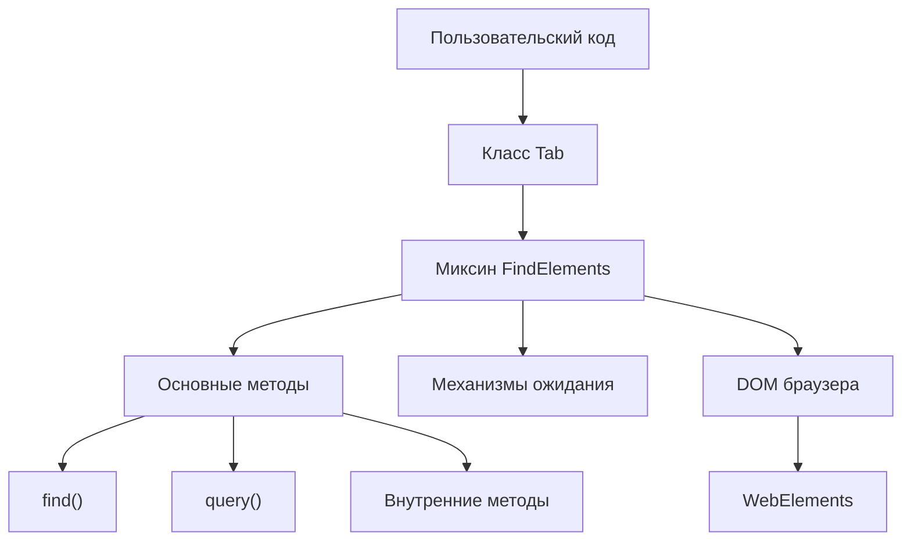
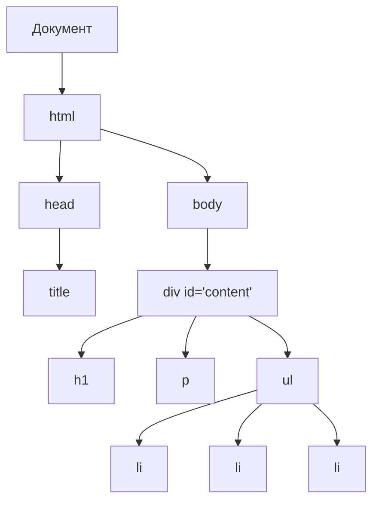
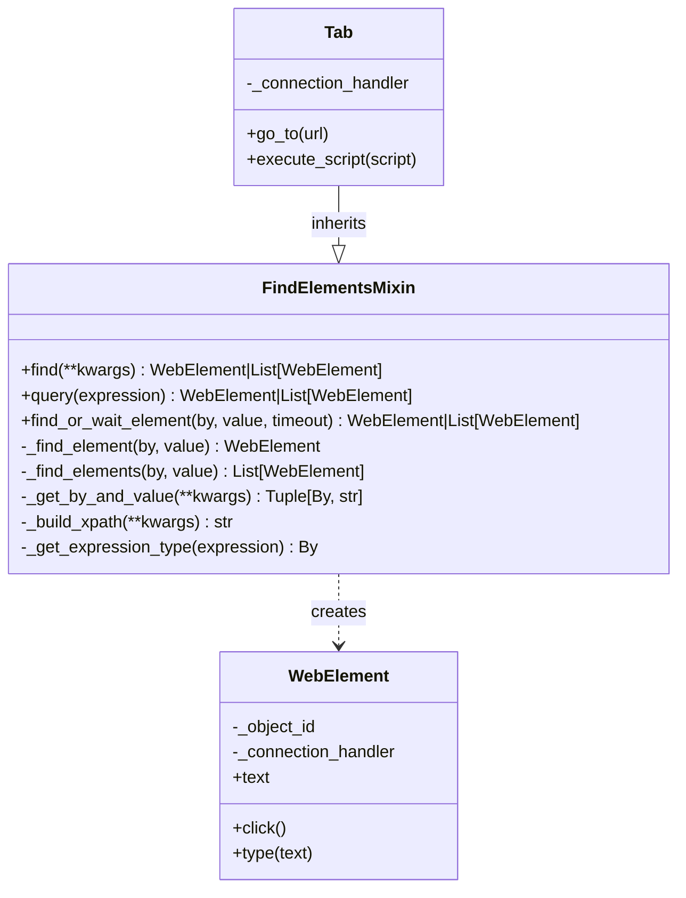

# Миксин FindElements

Миксин FindElements является фундаментальным компонентом в архитектуре Pydoll, который реализует стратегии поиска элементов с использованием различных типов селекторов. Этот миксин предоставляет основные возможности для поиска и взаимодействия с элементами в DOM, служа мостом между высокоуровневым кодом автоматизации и движком рендеринга браузера.



## Понимание миксинов в Python

В объектно-ориентированном программировании миксин — это класс, который предоставляет методы другим классам, не считаясь базовым классом. В отличие от традиционного наследования, где подкласс наследует от родительского класса, представляющего отношение «является», миксины реализуют отношение «имеет» возможность.

```python
# Пример миксина в Python
class LoggerMixin:
    def log(self, message):
        print(f"LOG: {message}")
        
    def log_error(self, error):
        print(f"ERROR: {error}")

class DataProcessor(LoggerMixin):
    def process_data(self, data):
        self.log("Обработка данных...")
        # Обработать данные
        self.log("Обработка данных завершена")
```

Миксины предлагают несколько преимуществ в сложной архитектуре программного обеспечения:

1. **Повторное использование кода**: одна и та же функциональность может использоваться несколькими несвязанными классами
2. **Разделение ответственности**: каждый миксин обрабатывает определенный аспект функциональности
3. **Композиция вместо наследования**: позволяет избежать глубоких иерархий наследования
4. **Модульность**: функции можно добавлять или удалять независимо

!!! info "Миксин и множественное наследование"
    Хотя Python поддерживает множественное наследование, миксины являются особым шаблоном проектирования в рамках этой возможности. Миксин не предназначен для создания экземпляров самостоятельно и обычно не поддерживает состояние. Он предоставляет методы, которые могут использоваться другими классами, не устанавливая отношения «является».

## Объектная модель документа (DOM)

Прежде чем углубляться в стратегии выбора элементов, важно понять DOM, который представляет структуру HTML-документа в виде дерева объектов.



DOM является:

1. **Иерархическим**: элементы вкладываются в другие элементы, образуя отношения родитель-потомок
2. **Манипулируемым**: JavaScript может изменять структуру, содержимое и стиль
3. **Запрашиваемым**: элементы можно находить с помощью различных стратегий выбора
4. **Управляемым событиями**: элементы могут реагировать на взаимодействия с пользователем и другие события

### Протокол Chrome DevTools и доступ к DOM

Pydoll взаимодействует с DOM через протокол Chrome DevTools (CDP), который предоставляет методы для запроса и управления документом:

| Домен CDP | Назначение | Примеры команд |
|------------|---------|------------------|
| DOM | Доступ к структуре документа | `querySelector`, `getDocument` |
| Runtime | Выполнение JavaScript в контексте страницы | `evaluate`, `callFunctionOn` |
| Page | Операции на уровне страницы | `navigate`, `captureScreenshot` |

CDP позволяет как прямое манипулирование DOM через домен DOM, так и взаимодействие на основе JavaScript через домен Runtime. FindElementsMixin использует оба подхода для надежного выбора элементов.

## Основные методы API

Pydoll представляет два основных метода для поиска элементов, которые обеспечивают более интуитивно понятный и гибкий подход:

### Метод `find()`

Метод `find()` предоставляет интуитивно понятный способ поиска элементов с использованием общих атрибутов HTML:

```python
# Поиск по ID
element = await tab.find(id="username")

# Поиск по имени класса
element = await tab.find(class_name="submit-button")

# Поиск по имени тега
element = await tab.find(tag_name="button")

# Поиск по текстовому содержимому
element = await tab.find(text="Нажмите здесь")

# Поиск по атрибуту name
element = await tab.find(name="email")

# Комбинирование нескольких атрибутов
element = await tab.find(tag_name="input", name="password", type="password")

# Найти все совпадающие элементы
elements = await tab.find(class_name="item", find_all=True)

# Поиск с тайм-аутом
element = await tab.find(id="dynamic-content", timeout=10)
```

#### Сигнатура метода

```python
async def find(
    self,
    id: Optional[str] = None,
    class_name: Optional[str] = None,
    name: Optional[str] = None,
    tag_name: Optional[str] = None,
    text: Optional[str] = None,
    timeout: int = 0,
    find_all: bool = False,
    raise_exc: bool = True,
    **attributes,
) -> Union[WebElement, list[WebElement], None]:
```

#### Параметры

| Параметр | Тип | Описание |
|-----------|------|-------------|
| `id` | `Optional[str]` | Значение атрибута ID элемента |
| `class_name` | `Optional[str]` | Имя класса CSS для сопоставления |
| `name` | `Optional[str]` | Значение атрибута name элемента |
| `tag_name` | `Optional[str]` | Имя тега HTML (например, «div», «input») |
| `text` | `Optional[str]` | Текстовое содержимое для сопоставления внутри элемента |
| `timeout` | `int` | Максимальное количество секунд ожидания появления элементов |
| `find_all` | `bool` | Если True, возвращает все совпадения; если False, только первое совпадение |
| `raise_exc` | `bool` | Следует ли вызывать исключение, если элементы не найдены |
| `**attributes` | `dict` | Дополнительные атрибуты HTML для сопоставления |

### Метод `query()`

Метод `query()` обеспечивает прямой доступ с использованием селекторов CSS или выражений XPath:

```python
# Селекторы CSS
element = await tab.query("div.content > p.intro")
element = await tab.query("#login-form input[type='password']")

# Выражения XPath
element = await tab.query("//div[@id='content']/p[contains(text(), 'Добро пожаловать')]")
element = await tab.query("//button[text()='Отправить']")

# Сокращение для ID (автоматически определяется)
element = await tab.query("#username")

# Сокращение для класса (автоматически определяется)
element = await tab.query(".submit-button")

# Найти все совпадающие элементы
elements = await tab.query("div.item", find_all=True)

# Запрос с тайм-аутом
element = await tab.query("#dynamic-content", timeout=10)
```

#### Сигнатура метода

```python
async def query(
    self, 
    expression: str, 
    timeout: int = 0, 
    find_all: bool = False, 
    raise_exc: bool = True
) -> Union[WebElement, list[WebElement], None]:
```

#### Параметры

| Параметр | Тип | Описание |
|-----------|------|-------------|
| `expression` | `str` | Выражение селектора (CSS, XPath, ID с #, класс с .) |
| `timeout` | `int` | Максимальное количество секунд ожидания появления элементов |
| `find_all` | `bool` | Если True, возвращает все совпадения; если False, только первое совпадение |
| `raise_exc` | `bool` | Следует ли вызывать исключение, если элементы не найдены |

## Практические примеры использования

### Базовый поиск элементов

```python
import asyncio
from pydoll.browser.chromium import Chrome

async def basic_element_finding():
    browser = Chrome()
    tab = await browser.start()
    
    try:
        await tab.go_to("https://example.com/login")
        
        # Найти элементы формы входа
        username_field = await tab.find(id="username")
        password_field = await tab.find(name="password")
        submit_button = await tab.find(tag_name="button", type="submit")
        
        # Взаимодействовать с элементами
        await username_field.type_text("user@example.com")
        await password_field.type_text("password123")
        await submit_button.click()
        
    finally:
        await browser.stop()

asyncio.run(basic_element_finding())
```

### Расширенные комбинации селекторов

```python
async def advanced_selectors():
    browser = Chrome()
    tab = await browser.start()
    
    try:
        await tab.go_to("https://example.com/products")
        
        # Найти конкретный продукт, комбинируя атрибуты
        product = await tab.find(
            tag_name="div",
            class_name="product",
            data_category="electronics",
            data_price_range="500-1000"
        )
        
        # Найти все продукты в категории
        electronics = await tab.find(
            class_name="product",
            data_category="electronics",
            find_all=True
        )
        
        # Найти элемент по текстовому содержимому
        add_to_cart = await tab.find(text="Добавить в корзину")
        
        print(f"Найдено {len(electronics)} товаров электроники")
        
    finally:
        await browser.stop()
```

### Использование селекторов CSS и XPath

```python
async def css_and_xpath_examples():
    browser = Chrome()
    tab = await browser.start()
    
    try:
        await tab.go_to("https://example.com/table")
        
        # Селекторы CSS
        header_cells = await tab.query("table thead th", find_all=True)
        first_row = await tab.query("table tbody tr:first-child")
        
        # XPath для сложных выборок
        # Найти ячейку таблицы, содержащую определенный текст
        price_cell = await tab.query("//td[contains(text(), '$')]")
        
        # Найти кнопку в той же строке, что и определенный текст
        edit_button = await tab.query(
            "//tr[td[contains(text(), 'John Doe')]]//button[text()='Редактировать']"
        )
        
        # Найти все строки с ценой > 100 долларов (с использованием функций XPath)
        expensive_items = await tab.query(
            "//tr[number(translate(td[3], '$,', '')) > 100]",
            find_all=True
        )
        
        print(f"Найдено {len(expensive_items)} дорогих товаров")
        
    finally:
        await browser.stop()
```

## Механизмы ожидания

FindElementsMixin реализует сложные механизмы ожидания для обработки динамического содержимого:

### Ожидание на основе тайм-аута

```python
async def waiting_examples():
    browser = Chrome()
    tab = await browser.start()
    
    try:
        await tab.go_to("https://example.com/dynamic")
        
        # Ждать до 10 секунд появления элемента
        dynamic_content = await tab.find(id="dynamic-content", timeout=10)
        
        # Ждать нескольких элементов
        items = await tab.find(class_name="item", timeout=5, find_all=True)
        
        # Обрабатывать случаи, когда элемент может не появиться
        optional_element = await tab.find(
            id="optional-banner", 
            timeout=3, 
            raise_exc=False
        )
        
        if optional_element:
            await optional_element.click()
        else:
            print("Необязательный баннер не найден, продолжаем...")
            
    finally:
        await browser.stop()
```

### Стратегии обработки ошибок

```python
async def robust_element_finding():
    browser = Chrome()
    tab = await browser.start()
    
    try:
        await tab.go_to("https://example.com")
        
        # Стратегия 1: Попробовать несколько селекторов
        submit_button = None
        selectors = [
            {"id": "submit"},
            {"class_name": "submit-btn"},
            {"tag_name": "button", "type": "submit"},
            {"text": "Отправить"}
        ]
        
        for selector in selectors:
            try:
                submit_button = await tab.find(**selector, timeout=2)
                break
            except ElementNotFound:
                continue
        
        if not submit_button:
            raise Exception("Кнопка отправки не найдена ни одним селектором")
        
        # Стратегия 2: Изящная деградация
        try:
            premium_feature = await tab.find(class_name="premium-only", timeout=1)
            await premium_feature.click()
        except ElementNotFound:
            # Откатиться к базовой функции
            basic_feature = await tab.find(class_name="basic-feature")
            await basic_feature.click()
            
    finally:
        await browser.stop()
```

## Выбор стратегии селектора

FindElementsMixin автоматически выбирает наиболее подходящую стратегию селектора на основе предоставленных параметров:

### Выбор по одному атрибуту

Когда предоставляется только один атрибут, миксин использует наиболее эффективный селектор:

```python
# Они используют оптимизированные селекторы с одним атрибутом
await tab.find(id="username")           # Использует By.ID
await tab.find(class_name="button")     # Использует By.CLASS_NAME  
await tab.find(tag_name="input")        # Использует By.TAG_NAME
await tab.find(name="email")            # Использует By.NAME
```

### Выбор по нескольким атрибутам

Когда предоставляется несколько атрибутов, миксин создает выражение XPath:

```python
# Это создает XPath: //input[@type='password' and @name='password']
await tab.find(tag_name="input", type="password", name="password")

# Это создает XPath: //div[@class='product' and @data-id='123']
await tab.find(tag_name="div", class_name="product", data_id="123")
```

### Определение типа выражения

Метод `query()` автоматически определяет тип выражения:

```python
# Определяется как XPath (начинается с //)
await tab.query("//div[@id='content']")

# Определяется как ID (начинается с #)
await tab.query("#username")

# Определяется как класс (начинается с ., но не ./)
await tab.query(".submit-button")

# Определяется как селектор CSS (по умолчанию)
await tab.query("div.content > p")
```

## Внутренняя архитектура

FindElementsMixin реализует поиск элементов через сложную внутреннюю архитектуру:



### Основные внутренние методы

#### find_or_wait_element()

Основной метод, который обрабатывает как немедленный поиск, так и ожидание:

```python
async def find_or_wait_element(
    self,
    by: By,
    value: str,
    timeout: int = 0,
    find_all: bool = False,
    raise_exc: bool = True,
) -> Union[WebElement, list[WebElement], None]:
    """
    Основной метод поиска элементов с необязательной возможностью ожидания.
    
    Ищет элементы с гибким ожиданием. Если указан тайм-аут,
    повторно пытается найти элементы с задержкой 0,5 с до успеха или тайм-аута.
    """
```

Этот метод:
1. Определяет подходящий метод поиска (`_find_element` или `_find_elements`)
2. Реализует логику опроса с интервалами 0,5 секунды
3. Обрабатывает логику тайм-аута и вызова исключений
4. Возвращает соответствующие результаты на основе параметра `find_all`

#### _get_by_and_value()

Преобразует высокоуровневые параметры в совместимые с CDP стратегии селекторов:

```python
def _get_by_and_value(
    self,
    by_map: dict[str, By],
    id: Optional[str] = None,
    class_name: Optional[str] = None,
    name: Optional[str] = None,
    tag_name: Optional[str] = None,
    text: Optional[str] = None,
    **attributes,
) -> tuple[By, str]:
```

Этот метод:
1. Определяет, какие атрибуты были предоставлены
2. Для одиночных атрибутов возвращает соответствующий перечислитель `By` и значение
3. Для нескольких атрибутов создает выражение XPath с помощью `_build_xpath()`

#### _build_xpath()

Создает сложные выражения XPath из нескольких критериев:

```python
@staticmethod
def _build_xpath(
    id: Optional[str] = None,
    class_name: Optional[str] = None,
    name: Optional[str] = None,
    tag_name: Optional[str] = None,
    text: Optional[str] = None,
    **attributes,
) -> str:
```

Этот метод:
1. Создает базовый XPath (`//tag` или `//*`)
2. Добавляет условия для каждого предоставленного атрибута
3. Обрабатывает особые случаи, такие как имена классов и текстовое содержимое
4. Объединяет условия с помощью операторов `and`

### Генерация команд CDP

Миксин генерирует соответствующие команды CDP в зависимости от типа селектора:

#### Для селекторов CSS

```python
def _get_find_element_command(self, by: By, value: str, object_id: str = ''):
    # Преобразует в формат селектора CSS
    if by == By.CLASS_NAME:
        selector = f'.{escaped_value}'
    elif by == By.ID:
        selector = f'#{escaped_value}'
    
    # Использует DOM.querySelector или Runtime.evaluate
```

#### Для выражений XPath

```python
def _get_find_element_by_xpath_command(self, xpath: str, object_id: str):
    # Использует Runtime.evaluate с document.evaluate()
    script = Scripts.FIND_XPATH_ELEMENT.replace('{escaped_value}', escaped_value)
    command = RuntimeCommands.evaluate(expression=script)
```

## Соображения производительности

### Эффективность селектора

Различные типы селекторов имеют разные характеристики производительности:

| Тип селектора | Производительность | Сценарий использования |
|---------------|-------------|----------|
| ID | Самый быстрый | Уникальные элементы с атрибутами ID |
| Класс CSS | Быстрый | Элементы с определенным стилем |
| Имя тега | Быстрый | Когда вам нужны все элементы определенного типа |
| Селектор CSS | Хорошая | Сложные, но распространенные шаблоны |
| XPath | Медленнее | Сложные отношения и сопоставление текста |

### Стратегии оптимизации

```python
# Хорошо: используйте ID, когда он доступен
element = await tab.find(id="unique-element")

# Хорошо: используйте простые селекторы CSS
element = await tab.query("#form .submit-button")

# Избегайте: сложный XPath, когда подойдет CSS
# element = await tab.query("//div[@id='form']//button[@class='submit-button']")

# Хорошо: эффективно комбинируйте атрибуты
element = await tab.find(tag_name="input", type="email", required=True)

# Хорошо: используйте find_all=False, когда вам нужно только первое совпадение
first_item = await tab.find(class_name="item", find_all=False)
```

### Рекомендации по ожиданию

```python
# Хорошо: используйте соответствующие тайм-ауты
quick_element = await tab.find(id="static-content", timeout=2)
slow_element = await tab.find(id="ajax-content", timeout=10)

# Хорошо: изящно обрабатывайте необязательные элементы
optional = await tab.find(class_name="optional", timeout=1, raise_exc=False)

# Хорошо: используйте конкретные селекторы для уменьшения ложных срабатываний
specific_button = await tab.find(
    tag_name="button", 
    class_name="submit", 
    type="submit",
    timeout=5
)
```

## Обработка ошибок

FindElementsMixin обеспечивает комплексную обработку ошибок:

### Типы исключений

```python
from pydoll.exceptions import ElementNotFound, WaitElementTimeout

try:
    element = await tab.find(id="missing-element")
except ElementNotFound:
    print("Элемент не найден немедленно")

try:
    element = await tab.find(id="slow-element", timeout=10)
except WaitElementTimeout:
    print("Элемент не появился в течение тайм-аута")
```

### Изящная обработка

```python
# Вариант 1: использовать raise_exc=False
element = await tab.find(id="optional-element", raise_exc=False)
if element:
    await element.click()

# Вариант 2: try-except с откатом
try:
    primary_button = await tab.find(id="primary-action")
    await primary_button.click()
except ElementNotFound:
    # Откатиться к альтернативному селектору
    fallback_button = await tab.find(class_name="action-button")
    await fallback_button.click()
```

## Интеграция с WebElement

Найденные элементы возвращаются как экземпляры WebElement, которые предоставляют богатые возможности взаимодействия:

```python
# Найти и взаимодействовать с элементами формы
username = await tab.find(name="username")
await username.type_text("user@example.com")

password = await tab.find(type="password")
await password.type_text("secretpassword")

submit = await tab.find(tag_name="button", type="submit")
await submit.click()

# Получить свойства элемента
text_content = await username.text
is_visible = await username.is_visible()
attribute_value = await username.get_attribute("placeholder")
```

## Заключение

FindElementsMixin служит основой для взаимодействия с элементами в Pydoll, предоставляя мощный и интуитивно понятный API для поиска элементов DOM. Комбинация методов `find()` и `query()` обеспечивает гибкость как для простых, так и для сложных сценариев выбора элементов.

Ключевые преимущества дизайна FindElementsMixin:

1. **Интуитивно понятный API**: метод `find()` использует естественные имена атрибутов HTML
2. **Гибкий выбор**: поддержка селекторов CSS, XPath и комбинаций атрибутов
3. **Надежное ожидание**: встроенные механизмы тайм-аута и опроса
4. **Оптимизация производительности**: автоматический выбор наиболее эффективной стратегии селектора
5. **Обработка ошибок**: комплексная обработка исключений с возможностью изящной деградации

Понимая возможности и шаблоны FindElementsMixin, вы можете создавать надежную и поддерживаемую автоматизацию браузера, которая справляется со сложностями современных веб-приложений.