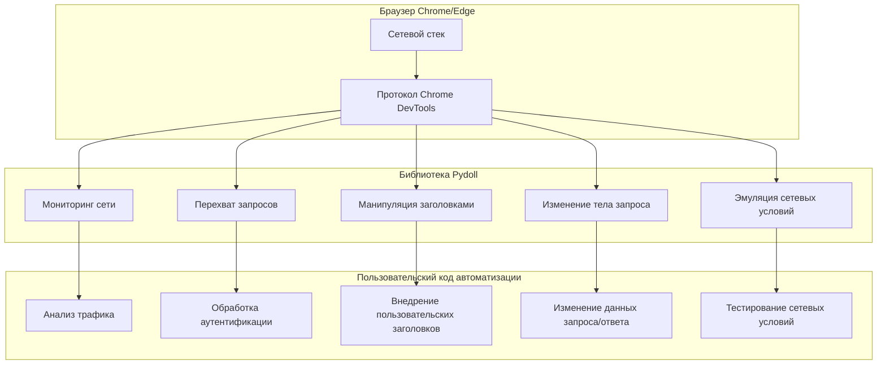
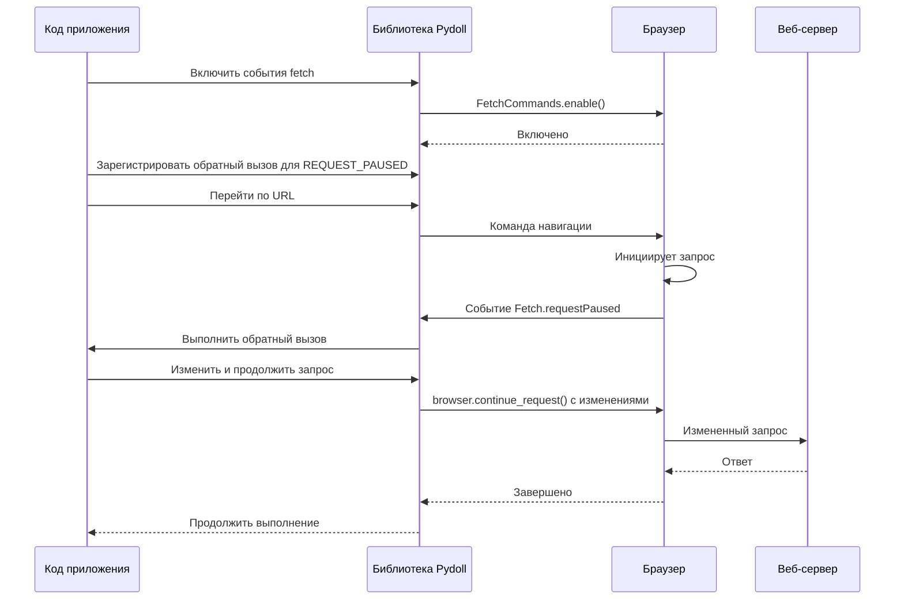

# Сетевые возможности

Pydoll предоставляет мощные возможности для мониторинга, перехвата и манипулирования сетевым трафиком во время автоматизации браузера. Эти функции дают вам детальный контроль над тем, как ваш браузер взаимодействует с вебом, открывая возможности для продвинутых сценариев использования, таких как изменение запросов, анализ ответов и оптимизация сети.

## Обзор сетевой архитектуры

Сетевые возможности Pydoll построены на основе протокола Chrome DevTools (CDP), который предоставляет прямой интерфейс к внутреннему сетевому стеку браузера. Эта архитектура устраняет ограничения традиционных подходов на основе прокси и обеспечивает мониторинг и изменение запросов и ответов в реальном времени.



Сетевые возможности в Pydoll можно разделить на две основные категории:

1. **Мониторинг сети**: пассивное наблюдение за сетевой активностью
2. **Перехват запросов**: активное изменение сетевых запросов и ответов

## Мониторинг сети

Мониторинг сети позволяет вам наблюдать и анализировать сетевую активность вашей сессии браузера, не изменяя ее. Это полезно для понимания того, как веб-сайт загружает ресурсы, обнаружения конечных точек API или устранения проблем с производительностью.

### Включение мониторинга сети

Чтобы начать мониторинг сетевой активности, вам необходимо включить сетевые события:

```python
import asyncio
from pydoll.browser.chromium import Chrome
from pydoll.protocol.network.events import NetworkEvent
from functools import partial

async def main():
    async with Chrome() as browser:
        tab = await browser.start()
        
        # Включить мониторинг сети
        await tab.enable_network_events()
        
        # Перейдите на страницу
        await tab.go_to('https://example.com')
        
        print("Мониторинг сети включен, страница загружена")
        
asyncio.run(main())
```

Когда вы включаете сетевые события, Pydoll автоматически собирает информацию обо всех сетевых запросах, включая:

- URL-адреса
- Методы HTTP
- Заголовки запросов
- Коды состояния
- Размеры ответов
- Типы контента
- Информацию о времени

### Обратные вызовы сетевых событий

Вы можете зарегистрировать обратные вызовы для получения уведомлений о конкретных сетевых событиях в режиме реального времени:

```python
from pydoll.protocol.network.events import NetworkEvent
from functools import partial

# Определить обратный вызов для обработки событий запроса
async def on_request(tab, event):
    url = event['params']['request']['url']
    method = event['params']['request']['method']
    
    print(f"{method} запрос к: {url}")
    
    # Вы можете получить доступ к заголовкам запроса
    headers = event['params']['request'].get('headers', {})
    if 'content-type' in headers:
        print(f"Content-Type: {headers['content-type']}")

# Определить обратный вызов для обработки событий ответа
async def on_response(tab, event):
    url = event['params']['response']['url']
    status = event['params']['response']['status']
    
    print(f"Ответ от {url}: Статус {status}")
    
    # Извлечь информацию о времени ответа
    timing = event['params']['response'].get('timing')
    if timing:
        total_time = timing['receiveHeadersEnd'] - timing['requestTime']
        print(f"Запрос выполнен за {total_time:.2f}с")

async def main():
    async with Chrome() as browser:
        tab = await browser.start()
        
        # Зарегистрировать обратные вызовы
        await tab.enable_network_events()
        await tab.on(NetworkEvent.REQUEST_WILL_BE_SENT, partial(on_request, tab))
        await tab.on(NetworkEvent.RESPONSE_RECEIVED, partial(on_response, tab))
        
        # Перейдите, чтобы вызвать сетевую активность
        await tab.go_to('https://example.com')
        
        # Подождите, чтобы увидеть сетевую активность
        await asyncio.sleep(5)

asyncio.run(main())
```

### Ключевые сетевые события

Pydoll предоставляет доступ к широкому спектру событий, связанных с сетью:

| Константа события | Описание | Доступная полезная информация |
|----------------|-------------|------------------------------|
| `NetworkEvent.REQUEST_WILL_BE_SENT` | Срабатывает, когда запрос вот-вот будет отправлен | URL, метод, заголовки, данные POST |
| `NetworkEvent.RESPONSE_RECEIVED` | Срабатывает, когда доступен HTTP-ответ | Код состояния, заголовки, тип MIME, время |
| `NetworkEvent.LOADING_FAILED` | Срабатывает, когда запрос не удался | Информация об ошибке, статус отмены |
| `NetworkEvent.LOADING_FINISHED` | Срабатывает, когда запрос завершен | Кодировка, размер сжатых данных |
| `NetworkEvent.RESOURCE_CHANGED_PRIORITY` | Срабатывает при изменении приоритета загрузки ресурса | Новый уровень приоритета |
| `NetworkEvent.WEBSOCKET_CREATED` | Срабатывает при создании WebSocket | URL, инициатор |
| `NetworkEvent.WEBSOCKET_FRAME_SENT` | Срабатывает при отправке фрейма WebSocket | Данные полезной нагрузки |
| `NetworkEvent.WEBSOCKET_FRAME_RECEIVED` | Срабатывает при получении фрейма WebSocket | Данные ответа |

### Пример расширенного мониторинга сети

Вот более полный пример, который отслеживает различные сетевые метрики:

```python
import asyncio
import time
from pydoll.browser.chromium import Chrome
from pydoll.protocol.network.events import NetworkEvent
from functools import partial

async def main():
    # Счетчики статистики
    stats = {
        'total_requests': 0,
        'completed_requests': 0,
        'failed_requests': 0,
        'bytes_received': 0,
        'request_types': {},
        'status_codes': {},
        'domains': {},
        'start_time': time.time()
    }
    
    async def update_dashboard():
        while True:
            # Рассчитать прошедшее время
            elapsed = time.time() - stats['start_time']
            
            # Очистить консоль и вывести статистику
            print("\033c", end="")  # Очистить консоль
            print(f"Панель мониторинга сетевой активности - работает {elapsed:.1f}с")
            print(f"Всего запросов: {stats['total_requests']}")
            print(f"Завершено: {stats['completed_requests']} | Неудачно: {stats['failed_requests']}")
            print(f"Получено данных: {stats['bytes_received'] / 1024:.1f} КБ")
            
            print("\nТипы запросов:")
            for rtype, count in sorted(stats['request_types'].items(), key=lambda x: x[1], reverse=True):
                print(f"  {rtype}: {count}")
            
            print("\nКоды состояния:")
            for code, count in sorted(stats['status_codes'].items()):
                print(f"  {code}: {count}")
            
            print("\nТоп доменов:")
            top_domains = sorted(stats['domains'].items(), key=lambda x: x[1], reverse=True)[:5]
            for domain, count in top_domains:
                print(f"  {domain}: {count}")
            
            await asyncio.sleep(1)
    
    # Запустить задачу обновления панели мониторинга
    dashboard_task = asyncio.create_task(update_dashboard())
    
    async with Chrome() as browser:
        tab = await browser.start()
        
        # Отслеживать начало запросов
        async def on_request_sent(tab, event):
            stats['total_requests'] += 1
            
            # Отслеживать тип запроса
            resource_type = event['params'].get('type', 'Other')
            stats['request_types'][resource_type] = stats['request_types'].get(resource_type, 0) + 1
            
            # Отслеживать домен
            url = event['params']['request']['url']
            try:
                from urllib.parse import urlparse
                domain = urlparse(url).netloc
                stats['domains'][domain] = stats['domains'].get(domain, 0) + 1
            except:
                pass
        
        # Отслеживать ответы
        async def on_response(tab, event):
            status = event['params']['response']['status']
            stats['status_codes'][status] = stats['status_codes'].get(status, 0) + 1
        
        # Отслеживать завершение запросов
        async def on_loading_finished(tab, event):
            stats['completed_requests'] += 1
            if 'encodedDataLength' in event['params']:
                stats['bytes_received'] += event['params']['encodedDataLength']
        
        # Отслеживать сбои
        async def on_loading_failed(tab, event):
            stats['failed_requests'] += 1
        
        # Зарегистрировать обратные вызовы
        await tab.enable_network_events()
        await tab.on(NetworkEvent.REQUEST_WILL_BE_SENT, partial(on_request_sent, tab))
        await tab.on(NetworkEvent.RESPONSE_RECEIVED, partial(on_response, tab))
        await tab.on(NetworkEvent.LOADING_FINISHED, partial(on_loading_finished, tab))
        await tab.on(NetworkEvent.LOADING_FAILED, partial(on_loading_failed, tab))
        
        # Перейдите на страницу с большим количеством запросов
        await tab.go_to('https://news.ycombinator.com')
        
        # Подождите, пока пользователь нажмет Enter для выхода
        await asyncio.sleep(60)
    
    # Очистка
    dashboard_task.cancel()

asyncio.run(main())
```

## Перехват и изменение запросов

Перехват запросов — это то, где сетевые возможности Pydoll действительно проявляют себя. В отличие от традиционных инструментов автоматизации браузеров, которые могут только наблюдать за сетевым трафиком, Pydoll позволяет вам перехватывать и изменять сетевые запросы перед их отправкой.

### Домен Fetch

Домен Fetch в протоколе Chrome DevTools предоставляет расширенные функциональные возможности для перехвата и манипулирования сетевыми запросами. Pydoll предоставляет эту функциональность через чистый API, который упрощает реализацию сложных сценариев манипулирования сетью.



### Включение перехвата запросов

Чтобы перехватывать запросы, вам необходимо включить домен Fetch:

```python
import asyncio
from pydoll.browser.chromium import Chrome
from pydoll.protocol.fetch.events import FetchEvent
from functools import partial

async def main():
    async with Chrome() as browser:
        tab = await browser.start()
        
        # Определить перехватчик запросов
        async def intercept_request(tab, event):
            request_id = event['params']['requestId']
            request = event['params']['request']
            url = request['url']
            
            print(f"Перехвачен запрос к: {url}")
            
            # Вы должны продолжить запрос, чтобы продолжить
            await browser.continue_request(request_id)
        
        # Включить события fetch и зарегистрировать перехватчик
        await tab.enable_fetch_events()
        await tab.on(FetchEvent.REQUEST_PAUSED, partial(intercept_request, tab))
        
        # Перейдите на страницу
        await tab.go_to('https://example.com')
        
asyncio.run(main())
```

!!! warning "Всегда продолжайте перехваченные запросы"
    При перехвате запросов вы всегда должны вызывать `browser.continue_request()`, `browser.fail_request()` или `browser.fulfill_request()`, чтобы разрешить перехваченный запрос. Если вы этого не сделаете, браузер зависнет в ожидании разрешения перехваченного запроса.

### Область перехвата и типы ресурсов

Вы можете ограничить область перехвата запросов определенными типами ресурсов:

```python
from pydoll.constants import ResourceType

# Перехватывать все запросы (может быть ресурсоемким)
await tab.enable_fetch_events()

# Перехватывать только запросы документов (HTML)
await tab.enable_fetch_events(resource_type=ResourceType.DOCUMENT)

# Перехватывать только запросы API XHR/fetch
await tab.enable_fetch_events(resource_type=ResourceType.XHR)

# Перехватывать только запросы изображений
await tab.enable_fetch_events(resource_type=ResourceType.IMAGE)
```

Доступные для перехвата типы ресурсов:

| Тип ресурса | Описание | Распространенные примеры |
|---------------|-------------|----------------|
| `ResourceType.DOCUMENT` | Основные документы HTML | HTML-страницы, iframe |
| `ResourceType.STYLESHEET` | Файлы CSS | .css файлы |
| `ResourceType.IMAGE` | Ресурсы изображений | .jpg, .png, .gif, .webp |
| `ResourceType.MEDIA` | Медиафайлы | .mp4, .webm, аудиофайлы |
| `ResourceType.FONT` | Файлы шрифтов | .woff, .woff2, .ttf |
| `ResourceType.SCRIPT` | Файлы JavaScript | .js файлы |
| `ResourceType.TEXTTRACK` | Файлы текстовых дорожек | .vtt, .srt (субтитры) |
| `ResourceType.XHR` | Вызовы XMLHttpRequest | Вызовы API, AJAX-запросы |
| `ResourceType.FETCH` | Запросы Fetch API | Современные вызовы API |
| `ResourceType.EVENTSOURCE` | События, отправляемые сервером | Потоковые соединения |
| `ResourceType.WEBSOCKET` | Соединения WebSocket | Связь в реальном времени |
| `ResourceType.MANIFEST` | Манифесты веб-приложений | .webmanifest файлы |
| `ResourceType.OTHER` | Другие типы ресурсов | Различные ресурсы |

### Возможности изменения запросов

При перехвате запросов вы можете изменять различные аспекты запроса перед его отправкой на сервер:

#### 1. Изменение URL и метода

```python
async def redirect_request(tab, event):
    request_id = event['params']['requestId']
    request = event['params']['request']
    url = request['url']
    
    # Перенаправлять запросы с одного домена на другой
    if 'old-domain.com' in url:
        new_url = url.replace('old-domain.com', 'new-domain.com')
        print(f"Перенаправление {url} на {new_url}")
        
        await browser.continue_request(
            request_id=request_id,
            url=new_url
        )
    # Изменить GET на POST для определенных конечных точек
    elif '/api/data' in url and request['method'] == 'GET':
        print(f"Преобразование GET в POST для {url}")
        
        await browser.continue_request(
            request_id=request_id,
            method='POST'
        )
    else:
        # Продолжить в обычном режиме
        await browser.continue_request(request_id)
```

#### 2. Добавление или изменение заголовков

```python
async def inject_headers(tab, event):
    request_id = event['params']['requestId']
    request = event['params']['request']
    url = request['url']
    
    # Получить существующие заголовки
    headers = request.get('headers', {})
    
    # Добавить или изменить заголовки
    custom_headers = [
        {'name': 'X-Custom-Header', 'value': 'CustomValue'},
        {'name': 'Authorization', 'value': 'Bearer your-token-here'},
        {'name': 'User-Agent', 'value': 'Custom User Agent String'},
    ]
    
    # Добавить существующие заголовки в список
    for name, value in headers.items():
        custom_headers.append({'name': name, 'value': value})
    
    await browser.continue_request(
        request_id=request_id,
        headers=custom_headers
    )
```

#### 3. Изменение тела запроса

```python
import json
import time

async def modify_post_data(tab, event):
    request_id = event['params']['requestId']
    request = event['params']['request']
    url = request['url']
    method = request['method']
    
    # Обрабатывать только запросы POST к определенным конечным точкам
    if method == 'POST' and '/api/submit' in url:
        # Получить исходные данные post, если они есть
        original_post_data = request.get('postData', '{}')
        
        try:
            # Разобрать исходные данные
            data = json.loads(original_post_data)
            
            # Изменить данные
            data['additionalField'] = 'injected-value'
            data['timestamp'] = int(time.time())
            
            # Преобразовать обратно в строку
            modified_post_data = json.dumps(data)
            
            print(f"Изменены данные POST для {url}")
            
            await browser.continue_request(
                request_id=request_id,
                post_data=modified_post_data
            )
        except json.JSONDecodeError:
            # Если не JSON, продолжить в обычном режиме
            await browser.continue_request(request_id)
    else:
        # Продолжить в обычном режиме для запросов, отличных от POST
        await browser.continue_request(request_id)
```

### Сбой и выполнение запросов

Помимо продолжения запросов с изменениями, вы также можете завершать запросы с ошибкой или выполнять их с пользовательскими ответами:

#### Сбой запросов

```python
from pydoll.constants import NetworkErrorReason

async def block_requests(tab, event):
    request_id = event['params']['requestId']
    request = event['params']['request']
    url = request['url']
    
    # Блокировать запросы к доменам отслеживания
    blocked_domains = ['google-analytics.com', 'facebook.com/tr']
    
    if any(domain in url for domain in blocked_domains):
        print(f"Блокировка запроса к: {url}")
        await browser.fail_request(request_id, NetworkErrorReason.BLOCKED_BY_CLIENT)
    else:
        await browser.continue_request(request_id)
```

#### Выполнение запросов с пользовательскими ответами

```python
async def mock_api_response(tab, event):
    request_id = event['params']['requestId']
    request = event['params']['request']
    url = request['url']
    
    # Имитировать ответы API
    if '/api/user' in url:
        mock_response = {
            'id': 123,
            'name': 'Mock User',
            'email': 'mock@example.com'
        }
        
        response_headers = [
            {'name': 'Content-Type', 'value': 'application/json'},
            {'name': 'Access-Control-Allow-Origin', 'value': '*'}
        ]
        
        print(f"Имитация ответа для: {url}")
        
        await browser.fulfill_request(
            request_id=request_id,
            response_code=200,
            response_headers=response_headers,
            response_body=json.dumps(mock_response)
        )
    else:
        await browser.continue_request(request_id)
```

### Обработка аутентификации

Домен Fetch также может перехватывать запросы на аутентификацию, позволяя вам автоматически обрабатывать аутентификацию HTTP:

```python
async def main():
    async with Chrome() as browser:
        tab = await browser.start()
        
        # Определить обработчик аутентификации
        async def handle_auth(tab, event):
            request_id = event['params']['requestId']
            auth_challenge = event['params']['authChallenge']
            
            print(f"Требуется аутентификация: {auth_challenge['origin']}")
            
            # Предоставить учетные данные
            await browser.continue_request_with_auth(
                request_id=request_id,
                auth_challenge_response='ProvideCredentials',
                username="username",
                password="password"
            )
        
        # Включить события fetch с обработкой аутентификации
        await tab.enable_fetch_events(handle_auth=True)
        await tab.on(FetchEvent.AUTH_REQUIRED, partial(handle_auth, tab))
        
        # Перейдите на страницу, требующую аутентификации
        await tab.go_to('https://protected-site.com')
```

## Продвинутые сетевые шаблоны

### Пример комплексного перехвата запросов

Вот полный пример, демонстрирующий различные методы перехвата:

```python
import asyncio
import json
from pydoll.browser.chromium import Chrome
from pydoll.protocol.fetch.events import FetchEvent
from pydoll.constants import NetworkErrorReason, ResourceType
from functools import partial

async def main():
    async with Chrome() as browser:
        tab = await browser.start()
        
        async def comprehensive_interceptor(tab, event):
            request_id = event['params']['requestId']
            request = event['params']['request']
            url = request['url']
            method = request['method']
            
            print(f"Перехват запроса {method} к: {url}")
            
            # Блокировать скрипты отслеживания
            if any(tracker in url for tracker in ['google-analytics', 'facebook.com/tr']):
                print(f"Блокировка трекера: {url}")
                await browser.fail_request(request_id, NetworkErrorReason.BLOCKED_BY_CLIENT)
                return
            
            # Имитировать ответы API
            if '/api/config' in url:
                mock_config = {
                    'feature_flags': {'new_ui': True, 'beta_features': True},
                    'api_version': '2.0'
                }
                
                await browser.fulfill_request(
                    request_id=request_id,
                    response_code=200,
                    response_headers=[
                        {'name': 'Content-Type', 'value': 'application/json'},
                        {'name': 'Cache-Control', 'value': 'no-cache'}
                    ],
                    response_body=json.dumps(mock_config)
                )
                return
            
            # Внедрять пользовательские заголовки для запросов API
            if '/api/' in url:
                headers = [
                    {'name': 'X-Custom-Client', 'value': 'Pydoll-Automation'},
                    {'name': 'X-Request-ID', 'value': f'req-{request_id}'}
                ]
                
                # Сохранить существующие заголовки
                for name, value in request.get('headers', {}).items():
                    headers.append({'name': name, 'value': value})
                
                await browser.continue_request(
                    request_id=request_id,
                    headers=headers
                )
                return
            
            # Продолжить все остальные запросы в обычном режиме
            await browser.continue_request(request_id)
        
        # Включить события fetch только для запросов XHR и Fetch
        await tab.enable_fetch_events(resource_type=ResourceType.XHR)
        await tab.on(FetchEvent.REQUEST_PAUSED, partial(comprehensive_interceptor, tab))
        
        # Перейдите и взаимодействуйте со страницей
        await tab.go_to('https://example.com')
        await asyncio.sleep(5)  # Подождите сетевой активности

asyncio.run(main())
```

## Соображения производительности

Хотя сетевые возможности Pydoll мощны, следует помнить о некоторых соображениях производительности:

1. **Выборочный перехват**: перехват всех запросов может значительно замедлить загрузку страницы. Будьте избирательны в отношении того, какие типы ресурсов вы перехватываете.

2. **Управление памятью**: обратные вызовы сетевых событий могут потреблять память, если они хранят большие объемы данных. Помните об использовании памяти в длительных сеансах автоматизации.

3. **Эффективность обратных вызовов**: делайте ваши обратные вызовы событий эффективными, особенно для высокочастотных событий, таких как сетевые запросы. Неэффективные обратные вызовы могут замедлить весь процесс автоматизации.

4. **Очистка**: всегда отключайте сетевые события и события fetch, когда вы закончили их использовать, чтобы предотвратить утечки памяти.

```python
# Включайте события только при необходимости
await tab.enable_network_events()
await tab.enable_fetch_events(resource_type=ResourceType.XHR)  # Перехватывать только запросы XHR

# Выполняйте свою работу по автоматизации...

# Очистка по завершении
await tab.disable_network_events()
await tab.disable_fetch_events()
```

## Лучшие практики

### 1. Эффективно используйте фильтрацию по типу ресурса

```python
# Плохо: перехватывать все запросы (влияние на производительность)
await tab.enable_fetch_events()

# Хорошо: только перехватывать те типы ресурсов, которые вам нужны
await tab.enable_fetch_events(resource_type=ResourceType.XHR)  # Для вызовов API
await tab.enable_fetch_events(resource_type=ResourceType.DOCUMENT)  # Для основных документов
```

### 2. Всегда разрешайте перехваченные запросы

```python
# Всегда разрешайте каждый перехваченный запрос
async def intercept_handler(tab, event):
    request_id = event['params']['requestId']
    
    try:
        # Внесите любые необходимые изменения
        custom_headers = [{'name': 'X-Custom', 'value': 'Value'}]
        
        # Продолжить запрос
        await browser.continue_request(
            request_id=request_id,
            headers=custom_headers
        )
    except Exception as e:
        print(f"Ошибка в обработчике запроса: {e}")
        # Всегда пытайтесь продолжить запрос, даже если произошла ошибка
        try:
            await browser.continue_request(request_id)
        except:
            pass
```

### 3. Реализуйте правильную обработку ошибок

```python
async def safe_network_handler(tab, event):
    request_id = event['params']['requestId']
    
    try:
        # Ваша логика перехвата здесь
        await process_request(event)
        await browser.continue_request(request_id)
    except Exception as e:
        print(f"Ошибка в обработчике запроса: {e}")
        # Попробуйте продолжить запрос, даже если произошла ошибка
        try:
            await browser.continue_request(request_id)
        except:
            # Если мы не можем продолжить, попробуйте завершить его с ошибкой
            try:
                await browser.fail_request(request_id, NetworkErrorReason.FAILED)
            except:
                pass
```

### 4. Используйте `partial` для чистого управления обратными вызовами

```python
from functools import partial

# Определите ваш обработчик с объектом tab в качестве первого параметра
async def handle_request(tab, config, event):
    # Теперь у вас есть доступ как к tab, так и к пользовательской конфигурации
    request_id = event['params']['requestId']
    
    if config['block_trackers'] and is_tracker(event['params']['request']['url']):
        await browser.fail_request(request_id, NetworkErrorReason.BLOCKED_BY_CLIENT)
    else:
        await browser.continue_request(request_id)

# Зарегистрируйте с помощью partial для предварительной привязки параметров
config = {"block_trackers": True}
await tab.on(
    FetchEvent.REQUEST_PAUSED, 
    partial(handle_request, tab, config)
)
```

## Заключение

Сетевые возможности Pydoll обеспечивают беспрецедентентный контроль над сетевым трафиком браузера, открывая возможности для продвинутых сценариев использования, выходящих за рамки традиционной автоматизации браузера. Независимо от того, отслеживаете ли вы вызовы API, внедряете ли пользовательские заголовки или изменяете данные запросов, эти функции могут значительно улучшить ваши рабочие процессы автоматизации.

Используя мощь протокола Chrome DevTools, Pydoll упрощает реализацию сложных шаблонов мониторинга и перехвата сети, сохраняя при этом высокую производительность и надежность.

Помните, что следует ответственно использовать эти возможности и учитывать последствия для производительности при обширном мониторинге и перехвате сети в ваших сценариях автоматизации.