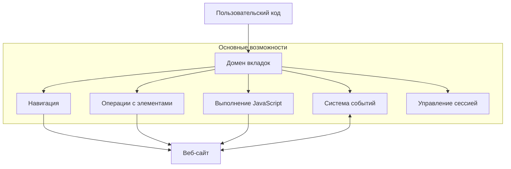
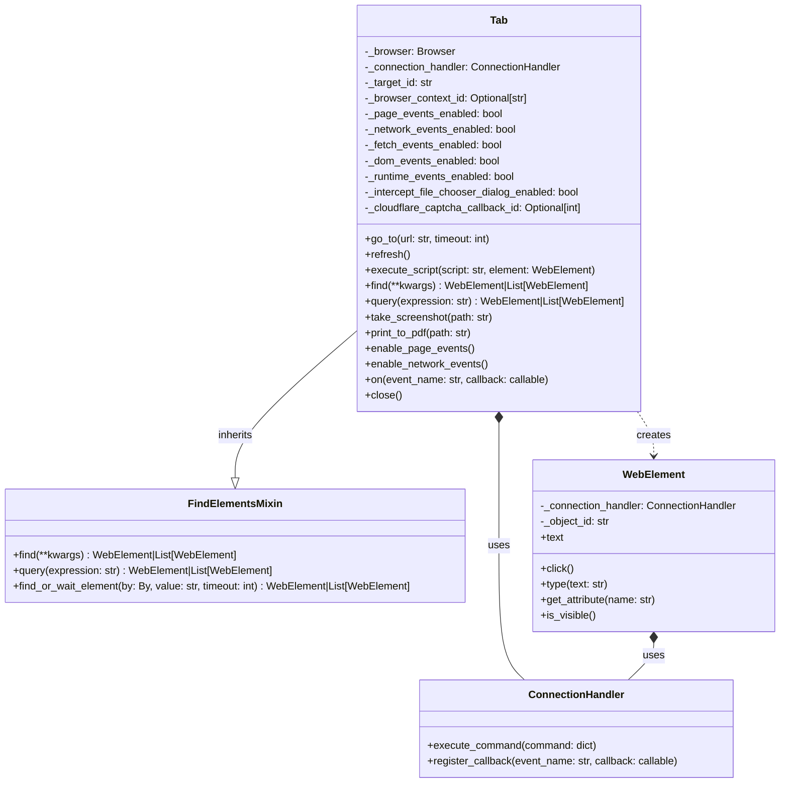
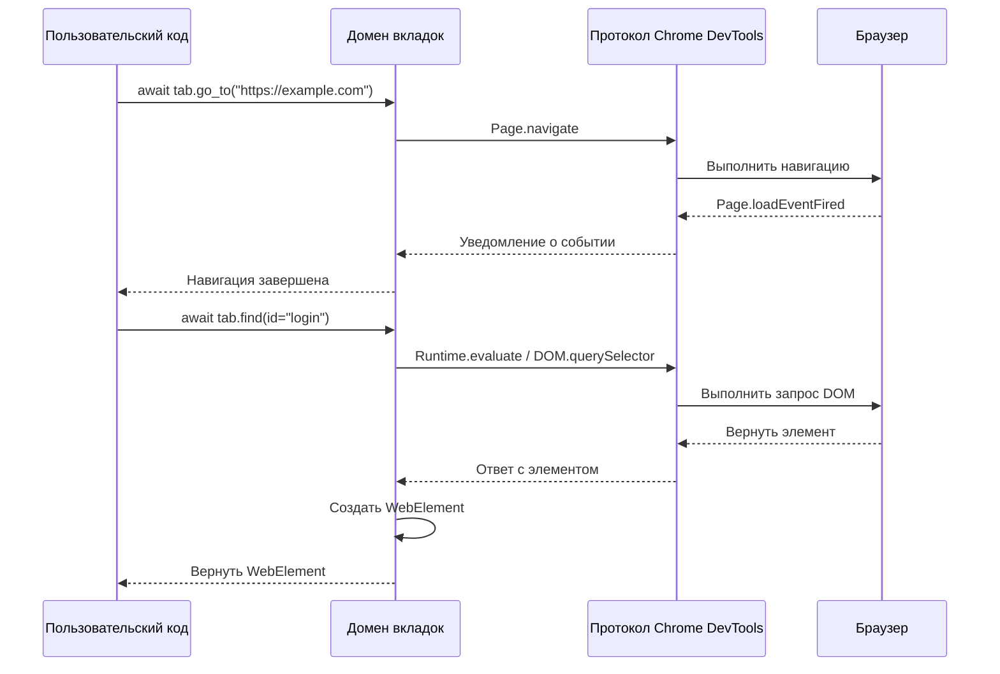
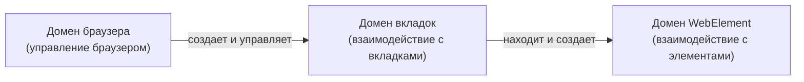

# Домен вкладок

Домен вкладок составляет ядро архитектуры Pydoll, предоставляя всеобъемлющий интерфейс для управления вкладками браузера и их содержимым. Этот домен соединяет ваш высокоуровневый код автоматизации с возможностями браузера, обеспечивая все, от базовой навигации до сложных шаблонов взаимодействия.



## Техническая архитектура

Домен вкладок в Pydoll действует как интеграционный слой между вашим кодом автоматизации и несколькими доменами протокола Chrome DevTools (CDP). Он реализован как конкретный класс, который объединяет несколько функциональных возможностей посредством композиции и наследования.



Дизайн использует несколько ключевых шаблонов:

1. **Наследование** - Класс Tab наследуется от FindElementsMixin для получения возможностей поиска элементов
2. **Композиция** - Он использует ConnectionHandler для управления связью с CDP
3. **Фабричный метод** - Он создает экземпляры WebElement при поиске элементов на вкладке
4. **Команда** - Он преобразует высокоуровневые методы в команды CDP
5. **Наблюдатель** - Он реализует систему событий для реагирования на события браузера

### Интеграция с CDP

Домен вкладок интегрируется с несколькими доменами CDP для предоставления своей функциональности:

| Домен CDP | Назначение |
|------------|---------|
| **Page** | Основной жизненный цикл страницы и навигация |
| **Runtime** | Выполнение JavaScript в контексте страницы |
| **DOM** | Структура документа и доступ к элементам |
| **Network** | Сетевые операции и управление файлами cookie |
| **Fetch** | Перехват и изменение запросов |
| **Storage** | Управление файлами cookie и хранилищем |

Эта интеграция создает мощную абстракцию, которая упрощает автоматизацию браузера, предоставляя при этом доступ ко всем возможностям базового протокола.



## Инициализация и управление состоянием

Класс Tab инициализируется параметрами из экземпляра браузера:

```python
def __init__(
    self,
    browser: 'Browser',
    connection_port: int,
    target_id: str,
    browser_context_id: Optional[str] = None,
):
    """
    Инициализировать контроллер вкладок для существующей вкладки браузера.

    Args:
        browser: Экземпляр браузера, создавший эту вкладку.
        connection_port: Порт WebSocket CDP.
        target_id: Идентификатор цели CDP для этой вкладки.
        browser_context_id: Необязательный идентификатор контекста браузера.
    """
    self._browser = browser
    self._connection_port = connection_port
    self._target_id = target_id
    self._connection_handler = ConnectionHandler(connection_port, target_id)
    self._page_events_enabled = False
    self._network_events_enabled = False
    self._fetch_events_enabled = False
    self._dom_events_enabled = False
    self._runtime_events_enabled = False
    self._intercept_file_chooser_dialog_enabled = False
    self._cloudflare_captcha_callback_id = None
    self._browser_context_id = browser_context_id
```

Класс Tab поддерживает несколько флагов состояния для отслеживания того, какие домены событий в настоящее время включены. Это управление состоянием имеет решающее значение для:

1. Предотвращения дублирующей регистрации событий
2. Точного отражения текущих возможностей вкладки
3. Обеспечения правильной очистки при закрытии вкладки

## Основные шаблоны и использование

Домен вкладок следует последовательному шаблону взаимодействия в Pydoll v2.0+:

```python
import asyncio
from pydoll.browser.chromium import Chrome

async def pydoll_example():
    # Создать экземпляр браузера и получить начальную вкладку
    browser = Chrome()
    tab = await browser.start()  # Возвращает Tab напрямую
    
    try:
        # Работать с вкладкой...
        await tab.go_to("https://example.com")
        
        # Найти и взаимодействовать с элементами
        button = await tab.find(id="submit")
        await button.click()
        
    finally:
        # Очистить по завершении
        await browser.stop()

# Запустить ваш пример с asyncio
asyncio.run(pydoll_example())
```

Большинство примеров в этой документации предполагают, что браузер и вкладка уже созданы и будут должным образом очищены.

## Система навигации

Домен вкладок обеспечивает плавный опыт навигации благодаря комбинации методов, которые абстрагируют сложности навигации в браузере:

```python
# Перейдите на страницу с настраиваемым тайм-аутом
await tab.go_to("https://example.com", timeout=60)

# Получить текущий URL
current_url = await tab.current_url
print(f"Текущий URL: {current_url}")

# Получить исходный код страницы
source = await tab.page_source
print(f"Длина исходного кода страницы: {len(source)}")

# Обновить страницу
await tab.refresh()
```

!!! tip "Расширенная навигация"
    Для специализированных сценариев навигации вы можете комбинировать навигацию со слушателями событий:
    
    ```python
    # Слушать сетевые запросы во время навигации
    await tab.enable_network_events()
    await tab.on('Network.responseReceived', handle_response)
    
    # Перейдите на страницу
    await tab.go_to('https://example.com')
    ```

Под капотом система навигации выполняет несколько операций:

1. Отправляет команду навигации через обработчик соединения
2. Отслеживает состояние загрузки страницы посредством периодической оценки JavaScript
3. Управляет тайм-аутами для предотвращения бесконечных ожиданий
4. Обрабатывает оптимизацию обновления при переходе на текущий URL


## Выполнение JavaScript

Система выполнения JavaScript в домене вкладок предоставляет два различных режима выполнения:

1. **Глобальное выполнение**: оценивает JavaScript в глобальном контексте страницы
2. **Выполнение в контексте элемента**: выполняет JavaScript с элементом в качестве контекста

```python
# Выполнить JavaScript в контексте страницы
dimensions = await tab.execute_script("""
    return {
        width: window.innerWidth,
        height: window.innerHeight,
        devicePixelRatio: window.devicePixelRatio
    }
""")
print(f"Размеры окна: {dimensions}")

# Найти элемент и управлять им с помощью JavaScript
heading = await tab.find(tag_name="h1")

# Выполнить JavaScript с элементом в качестве контекста
await tab.execute_script("""
    // 'argument' ссылается на элемент
    argument.style.color = 'red';
    argument.style.fontSize = '32px';
    argument.textContent = 'Изменено с помощью JavaScript';
""", heading)
```

!!! warning "Безопасность выполнения скриптов"
    При выполнении скриптов помните о последствиях для безопасности:
    
    - Скрипты выполняются с полными разрешениями страницы
    - Проверка ввода имеет решающее значение, если содержимое скрипта включает пользовательские данные
    - Рассмотрите возможность использования методов элементов вместо скриптов для стандартных операций

Реализация преобразует предоставленный код JavaScript и параметры в соответствии с требованиями CDP:

1. Для глобального выполнения:
   - Скрипт отправляется непосредственно в Runtime.evaluate
2. Для выполнения в контексте элемента:
   - Скрипт оборачивается в функцию
   - Ссылки на «аргумент» заменяются на «this»
   - Функция вызывается с objectId элемента в качестве контекста

## Управление состоянием сессии

Домен вкладок реализует сложное управление состоянием сессии, которое работает с контекстами браузера:

```python
# Установить файлы cookie для этой вкладки
cookies_to_set = [
    {
        "name": "session_id",
        "value": "test_session_123",
        "domain": "example.com",
        "path": "/",
        "secure": True,
        "httpOnly": True
    }
]
await tab.set_cookies(cookies_to_set)

# Получить все файлы cookie, доступные с этой вкладки
all_cookies = await tab.get_cookies()
print(f"Количество файлов cookie: {len(all_cookies)}")

# Удалить все файлы cookie из контекста этой вкладки
await tab.delete_all_cookies()
```

!!! info "Управление файлами cookie для конкретной вкладки"
    Мощной функцией Pydoll является возможность управлять файлами cookie на уровне отдельных вкладок в контекстах браузера:
    
    ```python
    # Создать разные контексты для изоляции
    context1 = await browser.create_browser_context()
    context2 = await browser.create_browser_context()
    
    # Вкладки в разных контекстах имеют изолированные файлы cookie
    tab1 = await browser.new_tab("https://example.com", browser_context_id=context1)
    tab2 = await browser.new_tab("https://example.com", browser_context_id=context2)
    
    # Установить разные файлы cookie для каждой вкладки
    await tab1.set_cookies([{"name": "user", "value": "user_a", "domain": "example.com"}])
    await tab2.set_cookies([{"name": "user", "value": "user_b", "domain": "example.com"}])
    ```
    
    Эта возможность позволяет:
    - Тестировать взаимодействия пользователей между различными типами учетных записей
    - Сравнивать разные уровни разрешений пользователей бок о бок
    - Поддерживать несколько аутентифицированных сессий одновременно

## Захват содержимого

Домен вкладок предоставляет гибкие методы для захвата визуального содержимого:

```python
# Сделать скриншот и сохранить его в файл
await tab.take_screenshot("homepage.png")

# Получить скриншот в формате base64 (полезно для встраивания в отчеты)
screenshot_base64 = await tab.take_screenshot(as_base64=True)

# Сделать высококачественный скриншот
await tab.take_screenshot("high_quality.jpg", quality=95)

# Экспортировать страницу в PDF
await tab.print_to_pdf("homepage.pdf")

# Экспортировать PDF с настраиваемыми параметрами
await tab.print_to_pdf(
    "custom.pdf",
    landscape=True,
    print_background=True,
    scale=0.8
)
```

!!! info "Поддерживаемые форматы скриншотов"
    Pydoll поддерживает сохранение скриншотов в нескольких форматах:
    - PNG (.png): сжатие без потерь, лучше всего подходит для тестирования пользовательского интерфейса
    - JPEG (.jpg/.jpeg): сжатие с потерями, меньший размер файла
    
    Если вы попытаетесь использовать неподдерживаемый формат, Pydoll вызовет исключение `InvalidFileExtension`.

Эти возможности визуального захвата неоценимы для:
- Визуального регрессионного тестирования
- Создания документации
- Отладки сценариев автоматизации
- Архивирования содержимого страницы

## Обзор системы событий

Домен вкладок предоставляет всеобъемлющую систему событий для мониторинга и реагирования на события браузера:

```python
# Включить разные домены событий
await tab.enable_page_events()
await tab.enable_network_events()
await tab.enable_fetch_events()
await tab.enable_dom_events()
await tab.enable_runtime_events()

# Зарегистрировать обработчики событий
async def handle_load_event(event):
    print("Страница загружена!")

async def handle_network_response(event):
    url = event['params']['response']['url']
    print(f"Получен ответ от: {url}")

await tab.on('Page.loadEventFired', handle_load_event)
await tab.on('Network.responseReceived', handle_network_response)
```

### Свойства событий

Класс Tab предоставляет удобные свойства для проверки состояний событий:

```python
# Проверить, какие события включены
print(f"События страницы включены: {tab.page_events_enabled}")
print(f"Сетевые события включены: {tab.network_events_enabled}")
print(f"События Fetch включены: {tab.fetch_events_enabled}")
print(f"События DOM включены: {tab.dom_events_enabled}")
print(f"События Runtime включены: {tab.runtime_events_enabled}")
```

!!! info "Категории событий"
    Pydoll поддерживает несколько категорий событий, каждая из которых требует явного включения:
    
    - **События страницы**: навигация, загрузка, ошибки, обработка диалоговых окон
    - **Сетевые события**: запросы, ответы, WebSockets
    - **События DOM**: обновления документа, изменения атрибутов
    - **События Fetch**: перехват и изменение запросов
    - **События Runtime**: выполнение JavaScript и сообщения консоли

## Расширенные возможности

### Обработка капчи Cloudflare

Домен вкладок обеспечивает интеллектуальную обработку капчи Cloudflare с помощью двух различных подходов:

```python
# Подход с менеджером контекста (блокирует до тех пор, пока капча не будет решена)
async with tab.expect_and_bypass_cloudflare_captcha():
    await tab.go_to("https://site-with-cloudflare.com")
    # Продолжить только после решения капчи

# Подход с фоновой обработкой
await tab.enable_auto_solve_cloudflare_captcha()
await tab.go_to("https://another-protected-site.com")
# Код продолжается немедленно, капча решается в фоновом режиме

# По завершении автоматического решения
await tab.disable_auto_solve_cloudflare_captcha()
```

### Управление диалоговыми окнами

Pydoll реализует обработку диалоговых окон посредством мониторинга событий и отслеживания состояния:

```python
# Настроить обработчик диалоговых окон
async def handle_dialog(event):
    if await tab.has_dialog():
        message = await tab.get_dialog_message()
        print(f"Обнаружено диалоговое окно: {message}")
        await tab.handle_dialog(accept=True)

# Включить события страницы для обнаружения диалоговых окон
await tab.enable_page_events()
await tab.on('Page.javascriptDialogOpening', handle_dialog)

# Вызвать диалоговое окно с предупреждением
await tab.execute_script("alert('Это тестовое предупреждение')")
```

## Методы анализа сети

Домен вкладок предоставляет специализированные методы для анализа сетевого трафика и извлечения данных ответа. Эти методы требуют предварительного включения сетевых событий.

### Получение сетевых журналов

Метод `get_network_logs()` предоставляет доступ ко всем захваченным сетевым запросам:

```python
# Включить мониторинг сети
await tab.enable_network_events()

# Перейдите, чтобы вызвать сетевые запросы
await tab.go_to('https://example.com/api-heavy-page')

# Получить все сетевые журналы
all_logs = await tab.get_network_logs()
print(f"Захвачено {len(all_logs)} сетевых запросов")

# Фильтровать журналы по содержимому URL
api_logs = await tab.get_network_logs(filter='api')
static_logs = await tab.get_network_logs(filter='.js')
domain_logs = await tab.get_network_logs(filter='example.com')

print(f"Запросы API: {len(api_logs)}")
print(f"Файлы JavaScript: {len(static_logs)}")
print(f"Запросы домена: {len(domain_logs)}")
```

### Извлечение тела ответа

Метод `get_network_response_body()` позволяет извлекать фактическое содержимое ответа:

```python
from functools import partial
from pydoll.protocol.network.events import NetworkEvent

# Хранилище для захваченных ответов
captured_responses = {}

async def capture_api_responses(tab, event):
    """Захват тел ответов из вызовов API"""
    request_id = event['params']['requestId']
    response = event['params']['response']
    url = response['url']
    
    # Захватывать только ответы API
    if '/api/' in url and response['status'] == 200:
        try:
            # Извлечь тело ответа
            body = await tab.get_network_response_body(request_id)
            captured_responses[url] = body
            print(f"Захвачен ответ от: {url}")
        except Exception as e:
            print(f"Не удалось захватить ответ: {e}")

# Включить мониторинг сети и зарегистрировать обратный вызов
await tab.enable_network_events()
await tab.on(NetworkEvent.RESPONSE_RECEIVED, partial(capture_api_responses, tab))

# Перейдите, чтобы вызвать вызовы API
await tab.go_to('https://example.com/dashboard')
await asyncio.sleep(3)  # Подождать вызовов API

print(f"Захвачено {len(captured_responses)} ответов API")
```

### Практический пример анализа сети

Вот всеобъемлющий пример, сочетающий оба метода для тщательного анализа сети:

```python
import asyncio
import json
from functools import partial
from pydoll.browser.chromium import Chrome
from pydoll.protocol.network.events import NetworkEvent

async def comprehensive_network_analysis():
    async with Chrome() as browser:
        tab = await browser.start()
        
        # Хранилище для результатов анализа
        analysis_results = {
            'api_responses': {},
            'failed_requests': [],
            'request_summary': {}
        }
        
        async def analyze_responses(tab, event):
            """Анализ сетевых ответов"""
            request_id = event['params']['requestId']
            response = event['params']['response']
            url = response['url']
            status = response['status']
            
            # Отслеживать неудачные запросы
            if status >= 400:
                analysis_results['failed_requests'].append({
                    'url': url,
                    'status': status,
                    'request_id': request_id
                })
                return
            
            # Захватывать успешные ответы API
            if '/api/' in url and status == 200:
                try:
                    body = await tab.get_network_response_body(request_id)
                    
                    # Попробовать разобрать ответы JSON
                    try:
                        data = json.loads(body)
                        analysis_results['api_responses'][url] = {
                            'data': data,
                            'size': len(body),
                            'type': 'json'
                        }
                    except json.JSONDecodeError:
                        analysis_results['api_responses'][url] = {
                            'data': body,
                            'size': len(body),
                            'type': 'text'
                        }
                        
                except Exception as e:
                    print(f"Не удалось захватить ответ от {url}: {e}")
        
        # Включить мониторинг и зарегистрировать обратный вызов
        await tab.enable_network_events()
        await tab.on(NetworkEvent.RESPONSE_RECEIVED, partial(analyze_responses, tab))
        
        # Перейдите и выполните действия
        await tab.go_to('https://example.com/complex-app')
        await asyncio.sleep(5)  # Подождать сетевой активности
        
        # Получить исчерпывающие журналы
        all_logs = await tab.get_network_logs()
        api_logs = await tab.get_network_logs(filter='api')
        
        # Сгенерировать сводку
        analysis_results['request_summary'] = {
            'total_requests': len(all_logs),
            'api_requests': len(api_logs),
            'failed_requests': len(analysis_results['failed_requests']),
            'captured_responses': len(analysis_results['api_responses'])
        }
        
        # Отобразить результаты
        print("🔍 Результаты анализа сети:")
        print(f"   Всего запросов: {analysis_results['request_summary']['total_requests']}")
        print(f"   Запросы API: {analysis_results['request_summary']['api_requests']}")
        print(f"   Неудачные запросы: {analysis_results['request_summary']['failed_requests']}")
        print(f"   Захваченные ответы: {analysis_results['request_summary']['captured_responses']}")
        
        # Показать неудачные запросы
        if analysis_results['failed_requests']:
            print("\n❌ Неудачные запросы:")
            for failed in analysis_results['failed_requests']:
                print(f"   {failed['status']} - {failed['url']}")
        
        # Показать захваченные данные API
        if analysis_results['api_responses']:
            print("\n✅ Захваченные ответы API:")
            for url, info in analysis_results['api_responses'].items():
                print(f"   {url} ({info['type']}, {info['size']} байт)")
        
        return analysis_results

# Запустить анализ
asyncio.run(comprehensive_network_analysis())
```

### Сценарии использования для анализа сети

Эти методы анализа сети обеспечивают мощные сценарии автоматизации:

**Тестирование и проверка API:**
```python
# Проверка ответов API во время автоматического тестирования
api_logs = await tab.get_network_logs(filter='/api/users')
for log in api_logs:
    request_id = log['params']['requestId']
    response_body = await tab.get_network_response_body(request_id)
    data = json.loads(response_body)
    
    # Проверка структуры ответа
    assert 'users' in data
    assert len(data['users']) > 0
```

**Мониторинг производительности:**
```python
# Мониторинг времени и размеров запросов
all_logs = await tab.get_network_logs()
large_responses = []

for log in all_logs:
    if 'response' in log['params']:
        response = log['params']['response']
        if response.get('encodedDataLength', 0) > 1000000:  # > 1 МБ
            large_responses.append({
                'url': response['url'],
                'size': response['encodedDataLength']
            })

print(f"Найдено {len(large_responses)} больших ответов")
```

**Извлечение данных:**
```python
# Извлечение динамического содержимого, загруженного через AJAX
await tab.go_to('https://spa-application.com')
await asyncio.sleep(3)  # Подождать вызовов AJAX

data_logs = await tab.get_network_logs(filter='/data/')
extracted_data = []

for log in data_logs:
    request_id = log['params']['requestId']
    try:
        body = await tab.get_network_response_body(request_id)
        data = json.loads(body)
        extracted_data.extend(data.get('items', []))
    except:
        continue

print(f"Извлечено {len(extracted_data)} элементов данных")
```

### Обработка загрузки файлов

Домен вкладок предоставляет менеджер контекста для обработки загрузки файлов:

```python
# Путь к файлу для загрузки
file_path = "document.pdf"

# Использовать менеджер контекста для обработки диалогового окна выбора файла
async with tab.expect_file_chooser(files=file_path):
    # Найти и нажать кнопку загрузки
    upload_button = await tab.find(id="upload-button")
    await upload_button.click()
```

### Взаимодействие с IFrame

Работайте с iframe через домен вкладок:

```python
# Найти элемент iframe
iframe_element = await tab.find(tag_name="iframe")

# Получить экземпляр Tab для iframe
iframe_tab = await tab.get_frame(iframe_element)

# Взаимодействовать с содержимым внутри iframe
iframe_button = await iframe_tab.find(id="iframe-button")
await iframe_button.click()
```

## Управление жизненным циклом вкладок

### Закрытие вкладок

```python
# Закрыть определенную вкладку
await tab.close()

# Примечание: экземпляр Tab становится недействительным после закрытия
```

### Управление несколькими вкладками

```python
# Создать несколько вкладок
tab1 = await browser.start()  # Начальная вкладка
tab2 = await browser.new_tab("https://example.com")
tab3 = await browser.new_tab("https://github.com")

# Работать с разными вкладками
await tab1.go_to("https://google.com")
await tab2.find(id="search").type_text("Pydoll")
await tab3.find(class_name="header-search-input").type_text("automation")

# Закрыть определенные вкладки по завершении
await tab2.close()
await tab3.close()
```

## Оптимизация производительности

### Оптимизация событий

Включайте только те домены событий, которые необходимы для вашей текущей задачи:

```python
# ХОРОШО: включайте только то, что вам нужно
await tab.enable_network_events()  # Включить только сетевые события

# ПЛОХО: включение ненужных событий создает накладные расходы
await tab.enable_page_events()
await tab.enable_network_events()
await tab.enable_dom_events()
await tab.enable_fetch_events()
await tab.enable_runtime_events()
```

### Управление ресурсами

```python
# Использовать менеджеры контекста для автоматической очистки
async with Chrome() as browser:
    tab = await browser.start()
    
    # Включать события только при необходимости
    await tab.enable_page_events()
    
    try:
        # Ваш код автоматизации
        await tab.go_to("https://example.com")
    finally:
        # События автоматически очищаются при закрытии браузера
        pass
```

## Взаимосвязи доменов

Понимание архитектуры доменов Pydoll помогает прояснить, как домен вкладок вписывается в более широкую экосистему библиотеки:



**Домен браузера** находится на вершине иерархии, отвечая за жизненный цикл браузера, управление соединениями и глобальную конфигурацию. Он создает и управляет экземплярами вкладок с помощью таких методов, как `start()` и `new_tab()`.

**Домен вкладок** действует как важнейший посредник, работая в контексте определенной вкладки браузера. Он предоставляет методы для навигации, взаимодействия с содержимым, выполнения JavaScript и обработки событий. Фундаментальным аспектом является его способность находить элементы на вкладке и создавать экземпляры WebElement.

**Домен WebElement** представляет определенные элементы DOM. Каждый WebElement принадлежит вкладке и предоставляет специализированные методы для взаимодействий, таких как щелчки, ввод текста или получение свойств.

Эта многоуровневая архитектура обеспечивает несколько преимуществ:

- **Разделение ответственности**: каждый домен имеет четкое, четко определенное назначение
- **Повторное использование**: компоненты могут использоваться независимо при необходимости
- **Простота использования**: API следует естественному потоку от браузера → вкладки → элемента
- **Гибкость**: несколько вкладок могут работать в одном браузере с независимыми состояниями

## Заключение

Домен вкладок является центральным рабочим пространством для большинства задач автоматизации Pydoll. Его сложная архитектура объединяет несколько доменов CDP в единый API, который упрощает сложные сценарии автоматизации, сохраняя при этом всю мощь протокола Chrome DevTools.

Дизайн домена использует несколько архитектурных шаблонов:
- Наследование и композиция для организации кода
- Шаблон «Команда» для связи с CDP
- Шаблон «Наблюдатель» для обработки событий
- Шаблон «Фабрика» для создания элементов
- Менеджеры контекста для управления ресурсами

Ключевые преимущества домена вкладок в Pydoll v2.0+:

1. **Интуитивно понятный поиск элементов**: современные методы `find()` и `query()`
2. **Интеграция с контекстом браузера**: бесшовная работа с изолированными контекстами браузера
3. **Всеобъемлющая система событий**: полная поддержка событий CDP с простым включением/отключением
4. **Расширенная автоматизация**: встроенная обработка капчи, управление диалоговыми окнами и загрузка файлов
5. **Оптимизация производительности**: выборочное включение событий и правильное управление ресурсами

Понимая архитектуру, возможности и шаблоны домена вкладок, вы можете создавать сложные сценарии автоматизации браузера, которые эффективно обрабатывают навигацию, взаимодействие, события и управление состоянием в современных веб-приложениях.