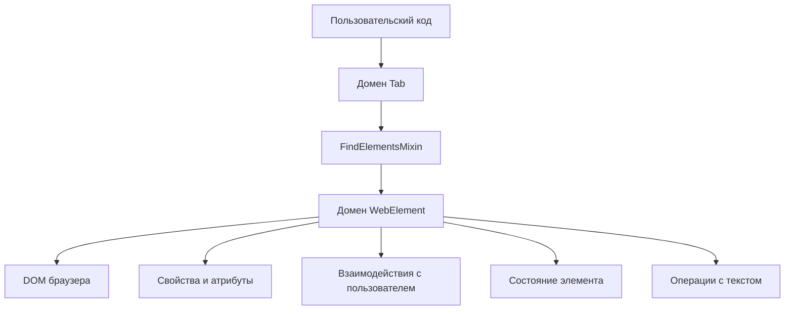
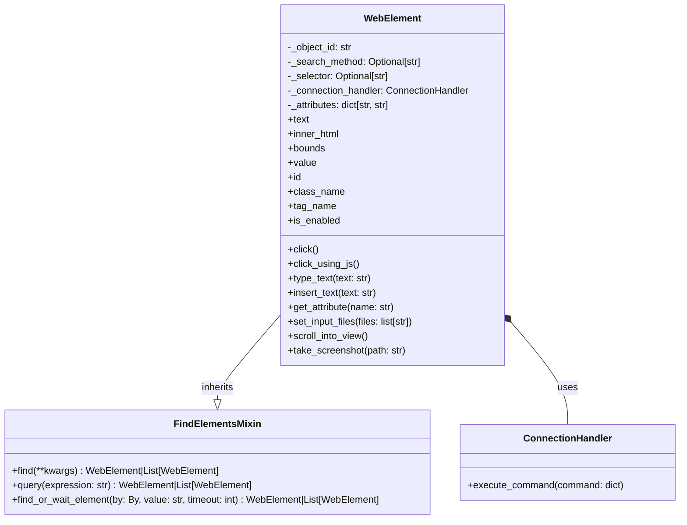

# Домен WebElement

Домен WebElement является краеугольным камнем архитектуры Pydoll, предоставляя богатое представление элементов DOM, которое обеспечивает интуитивно понятное и мощное взаимодействие с компонентами веб-страницы. Этот домен устраняет разрыв между высокоуровневым кодом автоматизации и базовыми элементами DOM, отображаемыми браузером.



## Понимание WebElement

По своей сути, WebElement представляет собой снимок элемента DOM на вкладке. В отличие от традиционных ссылок на DOM в JavaScript, WebElement в Pydoll:

1. **Асинхронный** - все взаимодействия следуют шаблону async/await в Python
2. **Постоянный** - сохраняет ссылку на элемент при смене страниц
3. **Автономный** - инкапсулирует все возможные операции над элементом DOM
4. **Интеллектуальный** - реализует специальную обработку для различных типов элементов

Каждый экземпляр WebElement хранит несколько важных частей информации:

```python
class WebElement(FindElementsMixin):
    def __init__(
        self,
        object_id: str,
        connection_handler: ConnectionHandler,
        method: Optional[str] = None,
        selector: Optional[str] = None,
        attributes_list: list[str] = [],
    ):
        self._object_id = object_id
        self._search_method = method
        self._selector = selector
        self._connection_handler = connection_handler
        self._attributes: dict[str, str] = {}
        self._def_attributes(attributes_list)
```

Основные компоненты включают:
- `object_id` предоставляет удаленную ссылку JavaScript на элемент
- `connection_handler` обеспечивает связь с браузером
- `_search_method` и `_selector` отслеживают, как был найден элемент
- `_attributes` словарь хранит атрибуты элемента

Наследуя от `FindElementsMixin`, каждый WebElement также может функционировать как отправная точка для поиска дочерних элементов.

## Техническая архитектура

Домен WebElement сочетает в себе несколько ключевых шаблонов проектирования для предоставления надежного и гибкого API:



Архитектурный дизайн следует нескольким ключевым принципам:

1. **Шаблон «Команда»** - взаимодействия с элементами преобразуются в команды CDP
2. **Система свойств** - сочетает синхронный доступ к атрибутам с асинхронным получением свойств DOM
3. **Наследование через Mixin** - наследует возможности поиска элементов через FindElementsMixin
4. **Шаблон «Мост»** - абстрагирует детали протокола CDP от API, ориентированного на пользователя

### Управление атрибутами

Уникальным аспектом дизайна WebElement является то, как он обрабатывает атрибуты HTML:

```python
def _def_attributes(self, attributes_list: list):
    """
    Определяет атрибуты элемента из плоского списка пар ключ-значение.
    """
    for i in range(0, len(attributes_list), 2):
        key = attributes_list[i]
        key = key if key != 'class' else 'class_name'
        value = attributes_list[i + 1]
        self._attributes[key] = value
```

Этот подход:
1. Обрабатывает атрибуты при создании элемента
2. Обеспечивает быстрый, синхронный доступ к общим атрибутам
3. Обрабатывает зарезервированные ключевые слова Python (например, `class` → `class_name`)
4. Формирует основу для строкового представления элемента

!!! info "Доступ к атрибутам и свойствам"
    WebElement предоставляет два взаимодополняющих способа доступа к данным элемента:
    
    - **Словарь атрибутов**: быстрый, синхронный доступ к атрибутам HTML, доступным при создании элемента
    - **Асинхронные свойства**: динамический доступ к текущему состоянию DOM через команды CDP
    
    ```python
    # Синхронный доступ к атрибутам (из исходного HTML)
    element_id = element.id
    element_class = element.class_name
    
    # Асинхронный доступ к свойствам (текущее состояние из DOM)
    element_text = await element.text
    element_bounds = await element.bounds
    ```

## Основные шаблоны взаимодействия

Домен WebElement предоставляет несколько категорий взаимодействий:

### Свойства элемента

WebElement предлагает как синхронный, так и асинхронный доступ к свойствам:

```python
# Синхронные свойства (из атрибутов, присутствующих при создании элемента)
element_id = element.id
element_class = element.class_name
is_element_enabled = element.is_enabled
element_value = element.value

# Асинхронные свойства (получаемые из живого DOM)
element_text = await element.text
element_html = await element.inner_html
element_bounds = await element.bounds
```

Реализация уравновешивает производительность и актуальность, определяя, какие свойства должны быть синхронными (статические атрибуты HTML), а какие — асинхронными (динамическое состояние DOM):

```python
@property
async def text(self) -> str:
    """
    Получает текст элемента.
    """
    outer_html = await self.inner_html
    soup = BeautifulSoup(outer_html, 'html.parser')
    return soup.get_text(strip=True)

@property
def id(self) -> str:
    """
    Получает id элемента.
    """
    return self._attributes.get('id')
```

### Взаимодействия с мышью

WebElement предоставляет несколько способов взаимодействия с элементами с помощью событий мыши:

```python
# Стандартный щелчок по центру элемента
await element.click()

# Щелчок со смещением от центра
await element.click(x_offset=10, y_offset=5)

# Щелчок с более длительным удержанием (например, для долгого нажатия)
await element.click(hold_time=1.0)

# Щелчок на основе JavaScript (полезно для элементов, по которым трудно щелкнуть)
await element.click_using_js()
```

Реализация интеллектуально обрабатывает различные типы элементов и состояния видимости:

```python
async def click(
    self,
    x_offset: int = 0,
    y_offset: int = 0,
    hold_time: float = 0.1,
):
    """
    Щелкает по элементу с помощью событий мыши.
    """
    if self._is_option_tag():
        return await self.click_option_tag()

    if not await self._is_element_visible():
        raise exceptions.ElementNotVisible(
            'Элемент не виден на странице.'
        )

    await self.scroll_into_view()
    
    # Получить положение элемента и рассчитать точку щелчка
    # ... (код расчета положения)
    
    # Отправить события нажатия и отпускания мыши
    press_command = InputCommands.mouse_press(*position_to_click)
    release_command = InputCommands.mouse_release(*position_to_click)
    await self._connection_handler.execute_command(press_command)
    await asyncio.sleep(hold_time)
    await self._connection_handler.execute_command(release_command)
```

!!! tip "Обработка специальных элементов"
    Реализация WebElement включает специальную обработку для различных типов элементов:
    
    ```python
    # Элементы Option в выпадающих списках требуют специальной обработки щелчков
    if self._is_option_tag():
        return await self.click_option_tag()
    
    # Вводы файлов требуют специальной обработки выбора файлов
    await input_element.set_input_files("path/to/file.pdf")
    ```

### Взаимодействия с клавиатурой

WebElement предоставляет несколько способов ввода текста в элементы формы:

```python
# Быстрая вставка текста (быстрее, но менее реалистично)
await element.insert_text("Привет, мир!")

# Реалистичный ввод текста с настраиваемой скоростью
await element.type_text("Привет, мир!", interval=0.1)

# Отдельные события клавиш
await element.key_down(Key.CONTROL)
await element.key_down(Key.A)
await element.key_up(Key.A)
await element.key_up(Key.CONTROL)

# Нажатие и отпускание комбинации клавиш
await element.press_keyboard_key(Key.ENTER, interval=0.1)
```

!!! info "Обработка загрузки файлов"
    Для элементов ввода файлов WebElement предоставляет специальный метод:
    
    ```python
    # Загрузить один файл
    await file_input.set_input_files(["path/to/file.pdf"])
    
    # Загрузить несколько файлов
    await file_input.set_input_files(["file1.jpg", "file2.jpg"])
    ```

## Визуальные возможности

### Скриншоты элементов

WebElement может делать скриншоты определенных элементов:

```python
# Сделать скриншот только этого элемента
await element.take_screenshot("element.png")

# Сделать высококачественный скриншот
await element.take_screenshot("element.jpg", quality=95)
```

Эта реализация включает:
1. Получение границ элемента с помощью JavaScript
2. Создание области отсечения для скриншота
3. Создание скриншота только этой области
4. Сохранение изображения по указанному пути

```python
async def take_screenshot(self, path: str, quality: int = 100):
    """
    Сделать скриншот только этого элемента.
    
    Автоматически прокручивает элемент в поле зрения перед съемкой.
    """
    bounds = await self.get_bounds_using_js()
    clip = Viewport(
        x=bounds['x'],
        y=bounds['y'],
        width=bounds['width'],
        height=bounds['height'],
        scale=1,
    )
    screenshot = await self._connection_handler.execute_command(
        PageCommands.capture_screenshot(
            format=ScreenshotFormat.JPEG, clip=clip, quality=quality
        )
    )
    async with aiofiles.open(path, 'wb') as file:
        image_bytes = decode_base64_to_bytes(screenshot['result']['data'])
        await file.write(image_bytes)
```

!!! tip "Несколько методов получения границ"
    WebElement предоставляет два способа получения границ элемента:
    
    ```python
    # Использование домена DOM (основной метод)
    bounds = await element.bounds
    
    # Резервный вариант с использованием JavaScript (более надежен в некоторых случаях)
    bounds = await element.get_bounds_using_js()
    ```

## Интеграция с JavaScript

WebElement обеспечивает бесшовную интеграцию с JavaScript для операций, требующих прямого взаимодействия с DOM:

```python
# Выполнить JavaScript в контексте этого элемента
await element._execute_script("this.style.border = '2px solid red';")

# Получить результат выполнения JavaScript
visibility = await element._is_element_visible()
```

Реализация использует домен CDP Runtime для выполнения JavaScript с элементом в качестве контекста:

```python
async def _execute_script(
    self, script: str, return_by_value: bool = False
):
    """
    Выполняет скрипт JavaScript в контексте этого элемента.
    """
    return await self._execute_command(
        RuntimeCommands.call_function_on(
            self._object_id, script, return_by_value
        )
    )
```

## Проверка состояния элемента

WebElement предоставляет методы для проверки видимости и интерактивности элемента:

```python
# Проверить, виден ли элемент
is_visible = await element._is_element_visible()

# Проверить, находится ли элемент сверху в своей позиции
is_on_top = await element._is_element_on_top()
```

Эти проверки имеют решающее значение для надежной автоматизации, гарантируя, что с элементами можно взаимодействовать перед попыткой выполнения операций.

## Позиционирование и прокрутка

Домен WebElement включает методы для позиционирования и прокрутки:

```python
# Прокрутить элемент в поле зрения
await element.scroll_into_view()

# Получить границы элемента
bounds = await element.bounds
```

Эти возможности гарантируют, что элементы видны в области просмотра перед взаимодействием, имитируя, как реальный пользователь будет взаимодействовать со страницей.

## Соображения производительности и надежности

Домен WebElement уравновешивает производительность и надежность с помощью нескольких ключевых стратегий:

### Умные резервные варианты

Многие методы реализуют несколько подходов, чтобы обеспечить успешное выполнение операций даже в сложных сценариях:

```python
async def click(self, ...):
    # Сначала попробуйте использовать события мыши CDP
    # Если это не удается, переключитесь на щелчок JavaScript
    # Если и это не удается, предоставьте четкое сообщение об ошибке
```

### Выбор подходящего контекста

Реализация выбирает наиболее подходящий контекст для каждой операции:

| Операция | Подход | Обоснование |
|-----------|----------|-----------|
| Получить текст | Разбор HTML с помощью BeautifulSoup | Более точное извлечение текста |
| Щелчок | События мыши через CDP | Наиболее реалистичная симуляция пользователя |
| Выбрать опцию | Специализированный JavaScript | Требуется для элементов выпадающего списка |
| Проверить видимость | JavaScript | Наиболее надежен в разных браузерах |

### Пакетная обработка команд

Где это возможно, операции объединяются для уменьшения количества обращений к браузеру:

```python
# Получить границы элемента за одну операцию
bounds = await element.get_bounds_using_js()

# Рассчитать положение в локальном коде без дополнительных вызовов браузера
position_to_click = (
    bounds['x'] + bounds['width'] / 2,
    bounds['y'] + bounds['height'] / 2,
)
```

## Заключение

Домен WebElement предоставляет всеобъемлющий и интуитивно понятный интерфейс для взаимодействия с элементами на веб-странице. Инкапсулируя сложности взаимодействия с DOM, обработки событий и управления состоянием, он позволяет коду автоматизации сосредоточиться на высокоуровневых задачах, а не на низкоуровневых деталях.

Домен демонстрирует несколько ключевых принципов проектирования:

1. **Абстракция** - скрывает сложность команд CDP за чистым API
2. **Специализация** - обеспечивает уникальную обработку для различных типов элементов
3. **Гибридный доступ** - уравновешивает синхронные и асинхронные операции для оптимальной производительности
4. **Устойчивость** - реализует стратегии резервного копирования для общих операций

При использовании в сочетании с доменом Tab и доменом Browser, WebElement создает мощный набор инструментов для веб-автоматизации, который справляется со сложностями современных веб-приложений, предоставляя при этом простой и надежный API для разработчиков.